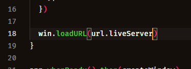
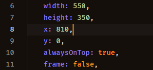

## **Navegador Electron**
### Esse app electron pode ser usado para aumentar a sua eficiência enquanto programa, ele pode mostrar em uma pequena tela o que você está desenvolvimento e atualiza automaticamente

  
Instalação do Electron

        npm i electron

  
Customização do app

        acessar url.js para configurar suas rotas
         index.js, linha 18, coloque url.{rota}, exemplo:
         
         Caso precise reposicionar a janela, modifique a linha 8, como o exemplo abaixo:
         

    
Inicialização do app

    Digite no console, "npm start"

