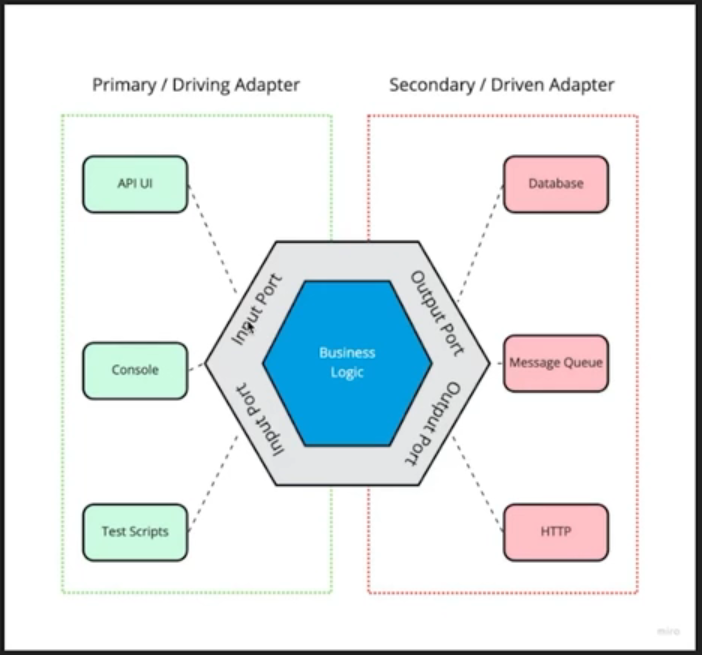

# Engenharia de Software

- [Design vs Arquitetura](#design-vs-arquitetura)
  - [Arquitetura Hexagonal](#arquitetura-hexagonal)
  - [Clean Code (Arquitetura Limpa)](#clean-code-arquitetura-limpa)
  - [Domain-driven Design](#domain-driven-design)
    - [Padrões Estratégicos](#padrões-estratégicos)
    - [Padrões Táticos](#padrões-táticos)
- [Mensageria](#mensageria)
  - [Modelagem de Eventos](#modelagem-de-eventos)
  - [Arquitetura Orientada à Eventos](#arquitetura-orientada-à-eventos)
- [Microsserviços](#microsserviços)
  - [API Gateway](#api-gateway)
  - [Service Mesh](#service-mesh)
  - [Tipos de Microsserviços](#tipos-de-microsserviços)

## Design vs Arquitetura

Arquitetura de software é uma visão de alto-nível do seu código.

> Quando se fala de arquitetura de software não se mencionam linguagens específicas, já que arquitetura pode ser implementada com qualquer linguagem.

Design de softare é uma de baixo-nível do código, como as classes se comunicam, como ficarão organizadas as pastas, nomes dos arquivos, estrutura em geral.

- SOLID
- DRY, KISS
- Design Patterns

> O design de software também é agnostico de linguagem porém aqui se definem funções, classes, entidades e mais.

### Arquitetura Hexagonal

É uma arquitetura onde as regras de negócio ficam separadas de qualquer camada de infraestrutura (API, Console, Testes, Banco de Dados)

Essa camada de regra de negócios é chamada de **camada de domínio**.

### Clean Code (Arquitetura Limpa)

O Clean Code é uma forma de organizar a camada de domínio da sua aplicação.

O Clean Code pode ser separado em duas partes:

1. _Entities_ 
   São todas as entidades da sua aplicação, como seu usuário, produto, pagamento e etc.

2. _Services_ 
   São as regras de negócio da sua aplicação.

### Domain-driven Design

O domain-driven design consiste em desenvolver a camada de domínio do seu código em volta da realidade do negócio, com as nomeclaturas do negócio e etc.

#### Padrões Estratégicos

- Linguagem ubíqua (Onipresente)
  > Linguagem que transmite a realidade do negócio. Ex -> Uma escola não deveria chamar seus alunos de "users" no código.
- Contextos delimitados
  > Saber separar os tópicos daquele domínio. Ex -> Um software de investimentos tem a parte de _analytics_ para mostrar os resultados financeiros e _profile_ para mostrar os dados da conta do usuário.
- Domínio e subdomínio
  > Diferenciação do núcleo do domínio e de seus contextos satélites. Ex -> A Alura tem o contexto acadêmico e o de gamificação (pontuação), o contexto de gamificação é satélite do contexto núcleo acadêmico.

#### Padrões Táticos

- Entidades
- Repositórios
- Eventos
- Módulos
- Serviços

## Mensageria

Conceito de comunicação entre sistemas através de eventos.

Essa comunicação é feita de forma **assíncrona**.

Cada evento pode ter um **publisher** e um **subscriber**.

Um **publisher** é uma entidade que escreve eventos.
Um **subscriber** é uma entidade que escuta esses eventos.

A ideia é "terceirizar" uma tarefa para um sistema mais especializado.

Exemplo: Ao invés de ter uma única aplicação que lida com pagamentos, login, cadastros, essa aplicação poderia fazer a comunicação à um serviço de autenticação, à um serviço financeiro e por ai vai.

### Modelagem de Eventos

A modelagem de eventos é o processo de mapear todos os eventos necessários em um sistema.

O ponto principal é entender quais eventos são cruciais para o funcionamento da aplicação.

Exemplo: Num contexto de um e-commerce, eventos importantes seriam "client add item to cart", "client checkouts" e "client payment".

[Estude mais sobre](https://eventmodeling.org)

### Arquitetura Orientada à Eventos

É uma arquitetura de sistemas onde a comunicação entre eventos ocorre de forma \*assíncrona\*\* e com eventos.

Dessa forma sistemas conseguem escalar horizontalmente.

## Microsserviços

Em um sistema monolítico comum temos 1 projeto que guarda todas as regras de negócio, conexão com serviços e mais, porém existem problemas nessa arquitetura:

- Demora no deploy
  > A pipeline de CI/CD vai demorar mais, pois não é possível atualizar apenas uma parte da aplicação de forma individual
- Não é possível escalar apenas uma parte da aplicação (alocar mais recursos apenas à parte de pagamentos por exemplo)
- Caso aconteça um erro em uma parte da aplicação todo o resto vai cair junto

A arquitetura de microsserviços busca quebrar o projeto monolíticos em contextos e posteriormente em serviços, que podem ser "deployados" individualmente, com suas próprias tecnologias, times alocados para melhorias e manutenção, e com um único objetivo.

### Vantagens e Desvantagens

Vantagens:

- Maior escalabilidade e eficiência de recursos
- Falhas isoladas
- Deploys menores e mais rápidos
- Tecnologias independentes

Desvantagens:

- Maior complexidade de desenvolvimento, infraestrutura, comunicação
- Maiores custos
- Debug mais complexo

### Tipos de Microsserviços

| Nome                | Descrição                                                         |
| ------------------- | ----------------------------------------------------------------- |
| Data/Domain service | Serviço que oferece acesso direto à uma fonte de dados.           |
| Business service    | Serviço que possui regras de negócio.                             |
| Translation service | Uma camada sobre **serviços externos**, age como um centralizador |
| Edge service        | Um serviço específico para cada "cliente". (BFF)                  |

#### Serviços de Domínio

Um _data/domain service_ possui regras relacionadas a manipulação de informações de um domínio.

Exemplo:

- Fornece dados dos alunos da plataforma
- Insere um aluno da plataforma
- Atualiza registro de alunos da plataforma

Como construir um _data service_:

- _Domain-driven Design_
- Modele o domínio primeiro, não pense na persistência
- Construa o serviço pensando no contrato

#### Serviços de Negócio

Os serviços de negócio são caracterizados por executar ações de **mais alto nível** do negócio, possuem operações que envolvem mais de um domínio
Operações com mais de um domínio,

Exemplo:

Matrícula de aluno na alura; (business service)

- Domínio Financeiro (data service)
- Domínio Acadêmico (data service)
- Domínio de Gameficação (data service)

Como construir um _business service_:

- Identifique o processo que você pretende expor (ex: matrículas)
- Identifique os domínios que serão necessário nesse serviço (ex: financeiro, acadêmico e gameficação)
- Defina a API que será utilizada, focando no domínio e não nos dados
- Consuma serviços de domínio (_data/domain services_) para executar os processos

### Strangler Pattern

Separar um monolito em microsserviços através dos dados ou domínio.

Exemplo:

Separar a parte de usuários de um serviço em um data service mas ainda conectando no mesmo banco de dados.

Separar a parte de usuários de um serviço em um novo banco de dados e lidar com 2 bancos de dados na camada de infraestrutura.

#### Sidecar pattern

- Determine um processo comum
- Construa um módulo compartilhável
- Aplique esse sidecar nos serviços que precisam dele

### API Gateway

É um interceptador de requisições entre um cliente e um sistema com diversos serviços.

Um API Gateway escolhe quem chamar para cada recurso acessado, também pode definir regras que são executadas antes de chegar no microsserviço, como regras de validação por exemplo.

Esse sistema pode ser construído na "mão", com código ou pode ser utilizado a partir de um serviço como o [API Gateway da AWS](https://aws.amazon.com/api-gateway).

### Service Mesh

Uma camada de infraestrutura dedicada para "gestão" dos microsserviços, com diferentes funcionalidades:

- Observabilidade
- _Logging_
- Comunicação (HTTP, Load Balancing)
