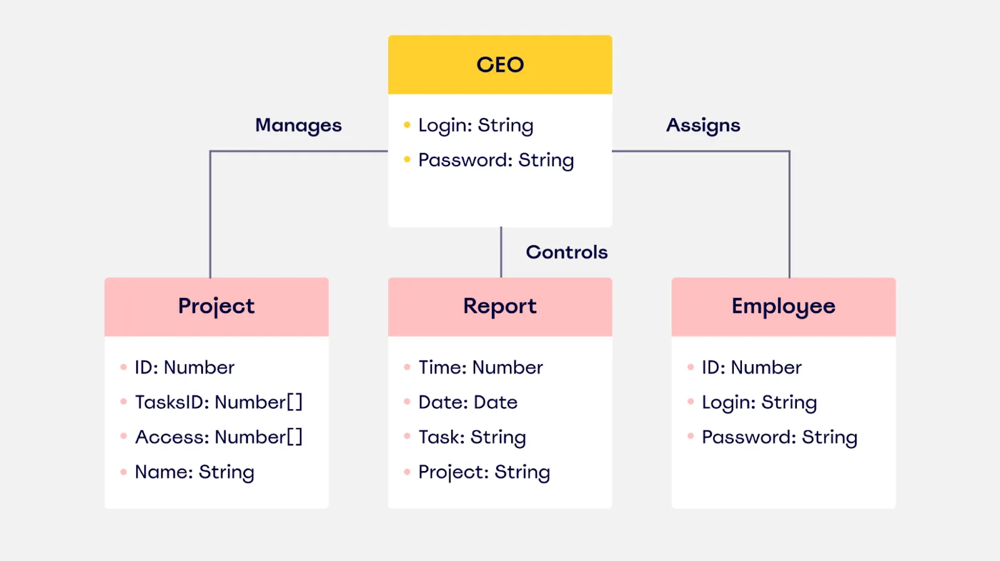

# Javascript: Programação Orientada a Objetos

Antes de estudar orientação a objetos vamos entender mais do que se tratam os paradigmas de programação.

## Paradigmas de programação

São abordagens sobre como resolver problemas de programação, baseadas em uma teoria ou conjunto de princípios.
TLDR; Uma forma específica de programar.

Alguns dos paradigmas são:

- Imperativo.
  > O código diz para o computador executar certas ações.
  ```js
  function dobra(vetor) {
    let resultados = [];

    for (let i = 0; i < vetor.length ; i++){
      resultados.push(vetor[i] * 2);
    }
    
    return resultados;
  }
  ```
- Relacional.
- Declarativo.
  > O código declara que certas coisas aconteçam, então o computador realiza o trabalho por baixo dos panos.
  ```html
    <h1> Programação Declarativa</h1>
    <p> Estou declarando como quero que o texto apareça, e não dizendo para o computador como renderizar um texto</p>
  ```
  ```js
    function (vetor) {
      return vetor.map((item) => item * 2);
    }
  ```

## Orientação a objetos

A programação orientada a objetos busca abstrair conceitos da vida real/requisitos de produto para o código, assim o código consegue ser reaproveitado e combinado.

### Conceitos

- Classe
  > Uma função responsável por instanciar um objeto.
- Objeto
  > Uma entidade no código responsável por modelar algo da aplicação. (Ex: usuário, curso, cliente)
- Instância
  > Uma unidade de objeto criado por uma classe.
- Propriedades
  > Todos os pares de chave-valor do objeto.
- Métodos
  > Funções que são declaradas no contexto do objeto.

### POO no Javascript

A partir do ES6 foi introduzido as Classes, um *syntactic sugar* sobre as funções.

Pois no javascript Pre-ES6 a forma de se lidar com herança e criação de objetos era utilizando as funções construtoras.

```js
// ES5
const User = function(name) {
  this.name = name // o 'this' é um "contexto" que todo objeto tem, onde é possível guardar algumas informações.
}

// ES6
class User {
  name // defining a field
  role = "common" // these fields can receive a default value just like function arguments.
  
  constructor(name, age) {
    this.name = name
    this.age = age // field can also be defined in runtime
  }
}

const User = (name) => {
  this.name = name // Isso não funciona pois 'arrow functions' não possuem um contexto 'this'.
}
```

### This, bind(), call(), apply()

O this é um contexto que todas as funções (sem ser arrow function) possuem no javascript, esse contexto é dado pelo Node.js/runtime e pode ser modificado ao adicionar propriedades e etc.

```js
function greet(name) {
  console.log(`Hello, ${name}! My name is ${this.name}.`);
}

const person = {
  name: "Alice",
};

greet.call(person, "Bob")        // Hello, Bob! My name is Alice.
greet.apply(person, ["Charlie"]) // Hello, Charlie! My name is Alice.
const boundGreet = greet.bind(person); 
boundGreet("David"); // Hello, David! My name is Alice.
```

As funções `call()`, `apply()` e `bind()` tem o poder de trocar o valor do "this" dentro de uma função.


## UML
Linguagem de modelagem para diagramas de objetos.


## Herdando propriedades sem utilizar classes

Existe um método em javascript, parte do objeto global "Object", responsável por "herdar" propriedades de um objeto à outro via os *prototypes*

```js
const user = {
  name: "vitor",
  email: "vitor@gmail.com",
  birthDate: "2005/03/11",
  role: "studend",
  active: true,
  showInfo() {}
}

const admin = {
  name: "system",
  email: "system@admin.com",
  role: "admin",
  createCourse() {
    console.log("creating course!")
  }
}

Object.setPrototypeOf(admin, user) // gives "user" object properties to "admin"
```

## Cadeia de protótipos

No javascript, a forma utilizada para que objetos herdem propriedades de outros objetos é a cadeia de protótipos.

Você pode visualizar isso ao ir ao console do navegador e criar qualquer objeto e logo depois acessar a propriedade `__proto__` dele.

Isso vai trazer todas as propriedades do protótipo daquele objeto, como ele foi criado sem se basear em nenhum outro projeto, então muito provavelmente está vazia.

Mas se você continuar a subir na cadeia de protótipos vai encontrar o protótipo do objeto global, que todos os objetos javascript herdam.

### Mas como funciona?

A forma como funciona é a seguinte:

```js
const user = {
  name: "vitor"
}

user.freeze() // o javascript vai procurar o método "freeze()" no objeto "user"

// ao não encontrar o método no objeto, vai subir na cadeia via a propriedade "__proto__", e lá, vai encontrar informações do objeto global. Onde existe o método "freeze()", logo ele será executado
```

Então é assim que funciona, o javascript vai subindo na cadeia de protótipos até encontrar um algum objeto nessa cadeia que contenha a propriedade ou método que você solicitou.

## Classes

Classes são um *syntatic sugar* da criação de objetos tradicional no javascript. Facilitam a criação de objetos, funções construtoras e mais.

Existem duas formas de criar classes, igual as funções. Classes nomeadas ou expressão de classe.

```js
// Classe nomeada
const User = class {
  constructor(name, email, role, active = true) {
    this.name = name
    this.email = email
    this.role = role || "student"
    this.active = active
  }

  serialize() {
    return JSON.stringify(this)  
  }
}

const user = new User("vitor", "vitor@gmail.com", "admin", true)

// Expressão de classe
class Admin extends User {
  constructor(name, email, role = "admin", active = true) {
    super(name, email, role, active)
  }

  createCourse() {
    console.log("course created!")
  }
}

const admin = new Admin("system", "system@gmail.com")
```

### Herdando propriedades

Para herdar propriedades de uma classe para outra basta utilizar a palavra chave `extends`, isso vai fazer com que essa nova classe contenha todas as propriedades e métodos da classe que você está herdando.

> Existe também a função "super()", para você passar informações para a função construtora da classe que você está herdando

```js
const User = class {
  constructor(name, email, role, active = true) {
    this.name = name
    this.email = email
    this.role = role || "student"
    this.active = active
  }

  serialize() {
    return JSON.stringify(this)  
  }
}

class Admin extends User {
  constructor(name, email, role = "admin", active = true) {
    super(name, email, role, active)
  }

  createCourse() {
    console.log("course created!")
  }
}

const admin = new Admin("system", "system@gmail.com")
// "admin" has access to "serialize()", and all properties from user
```

## Encapsulamento

Consiste em esconder dados de uma classe. No javascript conseguimos utilizar as seguintes funcionalidades para emular esse funcionamento:

- *Private Fields*
- Getters e Setters

### Private Fields

Para declarar propriedades e métodos privados dentro de uma classe podemos utilizar a sintaxe da cerquilha "#".

Todas as propriedades e/ou métodos privados só podem ser acessados de dentro da classe.

```js
class User {
  #name

  constructor(name) {
    this.#name = name
  }

  showName() {
    return this.#name
  }

  #showSensitiveData() {
    return this.password
  }
}

const user = new User("vitor")

console.log(user.name)                // undefined
console.log(user.showName())          // "vitor" 
console.log(user.showSensitiveData()) // undefined 
```

> Métodos privados não passam para classes-filhas via o `extends`.

### Getters e Setters

- Getters são funções que tem como principal funcionalidade retornar um valor porém são acessados com uma sintaxe de propriedade.

```js
class User {
  #name

  constructor(name) {
    this.#name = name
  }

  get name() {
    return this.#name
  }
}

const user = new User("vitor")

console.log(user.name) // "vitor"
```

- Setters são funções que tem como principal funcionalidade trocar um valor de dentro da classe.

```js
class User {
  #name

  constructor(name) {
    this.#name = name
  }

  set name(value) {
    this.#name = value
  }

  get name() {
    return this.#name
  }
}

const user = new User("vitor")

user.name = "test"
console.log(user.name)  // "test"
```

> Getters e setters passam para classes-filhas.

## Polimorfismo

Polimorfismo é a capacidade do código criar métodos com a mesma assinatura porém contém funcionamentos diferentes.

```js
class Entity {
  #id
  
  constructor(id) {
    this.#id = id
  }

  serialize() {
    return JSON.stringify({
      id: this.#id
    })
  }
}

class User extends Entity {
  #id
  #name
  
  constructor(id, name) {
    super(id)
    this.#id = id
    this.#name = name
  }

  serialize() {
    return JSON.stringify({
      id: this.#id,
      name: this.#name,
    })
  }
}

const user = new User("123", "vitor")

console.log(user.serialize()) // polimorfism overriding serialize method from "Entity"
```

# S.O.L.I.D

SOLID é um conjunto de design patterns composto por 5 conceitos principais:

- **S**ingle Responsibility Principle
  > Cada classe e objeto deve ser responsável por uma entidade apenas, cada método deve ser responsável por uma tarefa apenas.
- **O**pen/Closed Principle
  > Todas as classes devem estar abertas para serem extendidas, porém fechadas para serem modificadas.
- **L**iskov Substitution Principle
  > Sempre deve ser possível substituir a implementação de uma classe por outra implementação daquela mesma classe.
  ```js
  class PaymentProcessor {
    constructor() {
      // code...
    }
  }

  class Stripe extends PaymentProcessor {}
  
  class Stone extends PaymentProcessor {}

  const account = new Stripe() // this "new Stripe" should be replaceable with "new Stone" without breaking anything

  account.pay(50)
  ```
- **I**nterface Segregation Principle
  > As interfaces não devem ter declaração de métodos que as subclasses não vão utilizar.
- **D**ependecy Inversion Principle
  > Classes não podem depender da implementação de outras classes.
  ```js
  // ❌ WRONG
  class User {
    save() {
      const db = new SQLite();
    }
  }
  ```
  ```js
  // ✅ RIGHT
  class User {
    #Database

    constructor(database) {
      this.#Database = database
    }
    
    save() {
      const db = new this.Database();
    }
  }

  class MongoDB {
    // code...
  }

  class SQLiteDB {
    // code...
  }

  const user = new User(SQLiteDB) // the class can use any implementation of DB 
  const user2 = new User(MongoDB) // the class can use any implementation of DB 
  ```