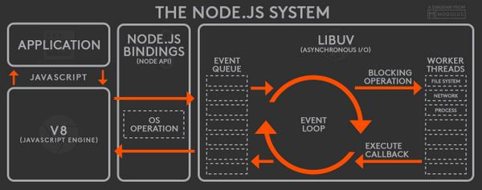

# Node.js: Criando uma API REST com Express.js e MongoDB

## O que é o Node.js

[Explicação básica do Node.js](../../js-backend/index.md)

O Node.js é um "executador" de código javascript, ele funciona independetemente do navegador.

[Documentação](https://nodejs.org/en/docs/guides/event-loop-timers-and-nexttick/)

Ele funciona através de um _event-loop_, onde existe uma fila de eventos e os itens dessa fila de eventos começam a ser executados 1 por 1.

Para cada item que precisa ser processado, o Node.js decide se vai jogar aquele processamento para uma thread do Kernel (Non-blocking I/O) ou se vai executar aquilo "ali na hora" (Blocking I/O).



Explicação Passo-a-Passo:

1. **Application** é seu index.js ou programa javascript.
2. **V8** é o mesmo interpretador de código que existe nos navegadores, ele vai transformar o código Javascript em objetos C++ e passar pro event queue do libuv.
3. **Node.js bindings** são as APIs do Node.js, `node:fs`, `node:path`, `node:http`
4. **Libuv** possui uma [event queue](https://nodejs.org/en/docs/guides/event-loop-timers-and-nexttick/#event-loop-explained), com uma lista de eventos a serem processados (seu código javascript), então decide se aquele código será executado de forma Non-blocking I/O em uma thread do Kernel:

- response.send()
- promises
- callbacks
- setTimeout
- setImmediate

  ou de forma [Blocking I/O](https://nodejs.org/en/docs/guides/dont-block-the-event-loop/) ali no C++:

- For, While
- File System
- Crypto

  > Blocking I/O significa que o Node.js está ocupado e não consegue responder e nem receber à novos eventos.

  > Non-blocking I/O significa que o Node.js consegue receber e responder à eventos, mesmo processando um `setTimeout`

## O que é uma API

Uma API é um serviço que permite a manipulação de dados através de regras de negócio.

APIs comumente utilizam do protocolo HTTP, servindo um _client_.

### REST

REST é um estilo de construção de APIs, onde se utiliza a estrutura JSON para comunicação das informações.

Além de uma padronização na organização de rotas e métodos HTTP.

Existem outras arquiteturas de APIs:

- SOAP
  > Utiliza de XML para tráfegar os dados
- Event-Driven
  > Não recebe requisições de um cliente, ao invés disso, escuta à eventos específicos como "novo usuário" ou "login de usuário"
- GraphQL
  > Utiliza de uma linguagem desenvolvida pelo Facebook onde o cliente escolhe quais dados quer receber de volta
- gRPC
  > Framework desenvolvido pela Google que funciona em cima do [HTTP/2](../http/index.md), onde se pode executar funções do servidor do lado do cliente

## Express.js

[Express.js](https://expressjs.com) é um framework para Node.js que permite a construção de APIs de forma facilitada.

Existem diversas camadas ao Express.js que ajudam na construção de aplicações web complexas.

- [_Middlewares_](https://expressjs.com/en/guide/using-middleware.html)
- [Rotas](https://expressjs.com/en/starter/basic-routing.html)

## MongoDB

O MongoDB é um banco de dados **não-relacional**, onde sua estrutura de dados é flexível e pode ser modificada a qualquer momento.

Ao contrário do Mongo, os bancos SQL são banco de dados **relacionais**, onde a estrutura dos dados **não** pode ser modificada a qualquer momento, pois são definidos na criação de uma tabela ou modificação da estrutura com código SQL.

O MongoDB possui as **collections**, que são como arrays do javascript, que contém múltiplos **documentos**. Cada documento pode ser interpretado como um **Objeto Javascript**.

Por possuir flexibilidade na modelagem de dados, é possível criar diferentes tipos de documentos:

```JSON
[
  {
    "_id": "6562852909986350334c770f", // "_id" é a primary-key de documentos BSON
    "name": "vitor",
    "location": "Maple Street",
  },
  {
    "_id": "6562852909986350334c87AD",
    "name": "vitor 2",
    "location": { // perceba a diferença na estrutura de dados
      "street": "Maple Street",
      "number": "204",
      "city": "Los Angeles",
    },
  },
]
```

## Arquitetura da API

Nessa API decidi por utilizar uma arquitetura simples, que lembrasse um pouco o SOLID mas com 1% da complexidade.

A aplicação é quebrada em 5 camadas:

|     | Nome       | Camada      |
| --- | ---------- | ----------- |
| 1   | Express    | Infra       |
| 2   | Controller | Application |
| 3   | Service    | Domain      |
| 4   | Repository | Application |
| 5   | MongoDB    | Infra       |

### Express

É da camada de infraestrutura pois é responsável por criar o servidor HTTP e se comunicar devidamente com o mundo externo.

Responsável por instanciar as rotas e chamar os controllers.

### Controller

É da camada de aplicação pois é responsável por receber os dados do mundo externo, tratá-los e torná-los em entidades de domínio.

Responsável por receber a requisição e retornar uma resposta.

### Service

É da camada de domain pois recebe entidades, executa as regras de negócio e retorna uma resposta.

Responsável por receber dados e retornar outros dados.

### Repository

O repository é uma interface para a persistência de dados, pode ser via API, Banco de Dados, Texto ou em memória.

### MongoDB

Nesse caso o MongoDB poderia ser qualquer outro client de banco de dados, API ou conexão com file system. É responsável por estabelecer a comunicação com o mundo externo (fora da aplicação).

- explicar estrutura do código e pastas
- explicar classes exceptions

# Node.js: Lidando com buscas, filtros, paginação e erros em uma API

## dotenv

Arquivos `.env` são utilizados para guardar informações sensíveis de uma aplicação durante o desenvolvimento, para evitar subir chaves e strings de acesso para o github ou qualquer repositório, para isso, podemos utilizar a biblioteca [dotenv](https://www.npmjs.com/package/dotenv) é utilizada para ler dos arquivos `.env` e variáveis de ambiente do sistema.

## eslint

O [ESLint](https://eslint.org) é uma ferramenta que procura por "erros" ou inconsistências no seu código Javascript.

O ESLint é totalmente customizável e é necessário certa configuração para o ver funcionando.

### prettier

Existe uma alternativa à essa ferramenta, chamada [prettier](https://prettier.io). O prettier é _plug-n-play_, ou seja, possui configurações pré-feita.

## Middlewares

Middlewares são interceptadores de rota, eles executam código/lógica antes da requisição chegar no controller.

Os middlewares podem ser utilizados para verificação autenticação da requisição, _logging_ e transformações de dados.

No Express.js o uso de middlewares se dá pela seguinte sintaxe:

```js
app.use(express.json()); // lê dados JSON e coloca no request.body
app.use(cookieParser()); // transforma o header 'Cookie' em um objeto em request.cookies
app.use("/v1", routes.router); // Adiciona rotas com o prefixo '/v1'
```

## Tratamento de Erros

O tratamento correto de erros é muito importante tanto para quem utiliza da API quanto para a própria API.

Retornar e fazer _logging_ desses erros é essencial para entender o que causou um erro quando a aplicação estiver em produção.

O exemplo de erro abaixo vem da API do Stripe:

```json
{
  "error": "The product doesn't exist",
  "code": "1280",
  "status": "400"
}
```

## Validação de dados

Validação de dados é muito importante para garantir que os dados tem os tipos corretos para não causar nenhum problema.

Nessa aplicação a validação de dados é executada pela camada de _controller_ que se comunica com a camada de infra, esses dados **tem** que estar validados corretamente para que as regras de negócio sejam executadas sem problemas na camada de **domínio** nos `/usecases`

Feita no front-end e no back-end, ainda mais se suas APIs são publicas e acessadas por clientes diretamente.

## Buscas avançadas

A rota `/search` possui mecanismos que permitem uma busca mais detalhada e avançada de livros.

Essa rota possui 6 parâmetros de busca:

```js
const {
  title,
  author,
  page = 1,
  size = 10,
  minPages = 0,
  maxPages = 5000,
} = request.query;
```

| Nome     | Função                                            |
| -------- | ------------------------------------------------- |
| title    | Título do livro sendo buscado                     |
| author   | Nome do autor que criou o livro                   |
| page     | Número da página                                  |
| size     | Número de livros por página                       |
| minPages | Número mínimo de páginas que um livro tem que ter |
| maxPages | Número máximo de páginas que um livro tem que ter |

Esses parâmetros seriam utilizados pelo front-end na hora que uma pessoa buscasse em um site.

## Paginação de dados

A paginação de dados é uma otimização que foi adicionada para previnir que as requisições demorem muito ou carreguem muitos dados quando existirem muitos livros.

Então foi criado um sistema de páginas e livros por página, igual encontrado em muitos sites por ai.

A camada de controller é responsável por passar esses dados pelo use-case até o repository, onde o MongoDB vai executar as regras de `skip` e `limit` e retornar apenas os dados que buscamos.
