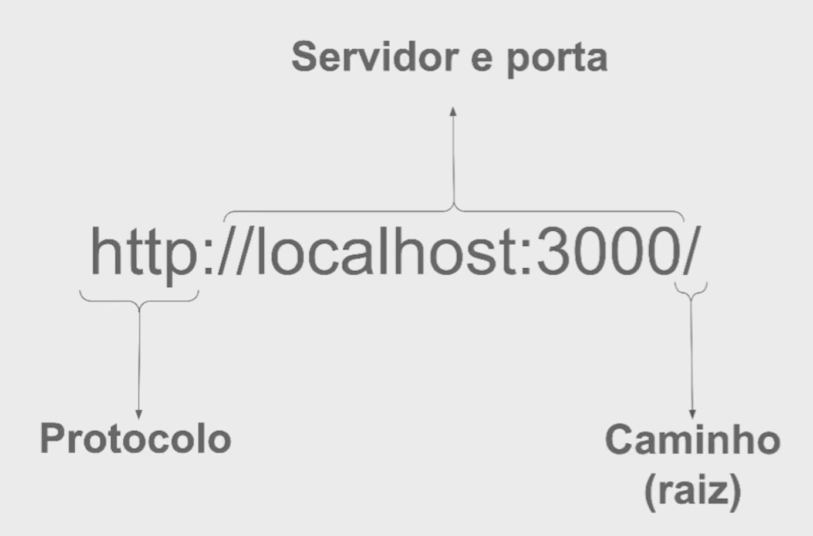
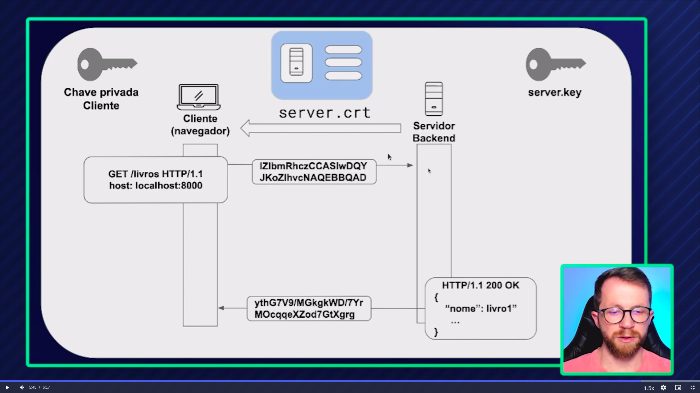

# HTTP: Entendendo a web por baixo dos panos

## Conhecendo o protocolo HTTP

> **HTTP** <br />
*Hyper Text Transfer Protocol*, é um protocolo de [aplicação](#as-camadas-da-internet) responsável por trocar informações entre um servidor e outro.

### As camadas da internet

- Física & Enlace <br />
  > Wi-fi, 5G, Rede cabeada
- Rede
  > Conexão ip
- Transporte
  > TCP, UDP
- Aplicação
  > No browser, nos smartphones

### O que é um protocolo

Um protocolo é uma conversa entre duas partes, com regras, entre o cliente e o servidor.

O cliente é sempre quem inicia essa conversa.

### Protocolos Existentes

O HTTP não é o único protocolo existente, existem diversos na verdade:

- FTP
  > *File Transfer Protocol*, para a trasferência de arquivos
- SMTP
  > *Simple Mail Transfer Protocol*, para a transferência de emails
- HTTPS
  > *Hyper Text Transfer Protocol Secure*
- IMAP
  > *Internet Message Access Protocol*
- DNS
  > *Domain Name System*
- BitTorrent

> O HTTP utiliza de conexões TCP para realizar sua comunicação

### Versões do HTTP

| HTTP/1.1 | HTTP/2 |
| -------- | ------ |
| Requisições síncronas* | Multiplexação* |
| Pode ser utilizado inseguro | SSL/HTTPS Necessário |
| Cabeçalhos textuais | Compactação de cabeçalho |
| *Request* obrigatório | [*Server push*](https://www.alura.com.br/artigos/http2-server-push-na-pratica) |

[Exemplo de um servidor HTTP/2 com Node.js](./http2-server.js)

Requisições síncronas*: É necessário esperar uma requisição terminar para iniciar outra.

Multiplexação*: Todas as requisições são unidas em uma única conexão TCP para deixar mais ágil

#### HTTP/3

O HTTP/1.1, HTTP/2, HTTPS e HTTP/3 se encontram na camada de [**aplicação**](#as-camadas-da-internet).

- A base por trás do HTTP/1.1 e HTTP/2 é o **TCP**.
- A base por trás do HTTPS é o **TLS**.
- A base por trás do HTTP/3 é o **QUIC**, variação do UDP.

☝️ Todos esses protocolos que mencionei, TCP, TLS e QUIC se encontram na camada de [**transporte**](#as-camadas-da-internet).

O HTTP/3 é um protocolo mais novo, que utiliza o QUIC por baixo dos panos. O QUIC é uma junção do TLS com o TCP, feito para ser mais simples e rápido.


A diferença do HTTP/3 com as outras versões é que ele consegue fazer a conexão com o servidor (TCP) e verificação de segurança (TLS) em um passo apenas.

## Aprendendo sobre URLs

URL é um mecanismo de localização de páginas na internet.

O problema que a URL resolve é que com tantas páginas na internet, como que as pessoas fariam para acha-lás? Pesquisariam "minha página"? Ou talvez "vitorgouveia página1"?

Então, a URL foi criada, *Uniform Resource Locator* é o mecânismo que permite que páginas sejam fácilmente encontradas na web.


> As páginas web HTTP por padrão estão na porta 80, então os navegadores omitem essa parte, porém a URL correta seria `http://www.domain.com:80/...`

> Para o HTTPS a porta padrão é a 443 `https://www.domain.com:443/...`



### DNS

Todos os sites precisam de um ip para serem acessados, porém é muito difícil ficar lembrando ip atrás de ip, então, o DNS é uma ferramenta que liga o nome de um domínio como `google.com` para o ip.

## Formato do Protocolo HTTP


A requisição HTTP é composta de algumas coisas:

`GET /public/login HTTP/1.1`

- GET
  > É o método da requisição HTTP
- /public/login
  > Rota sendo acessada no servidor
- HTTP/1.1
  > Informa qual protocolo sendo utilizado e a versão

### Requisições Complexas

Existem requisições mais complexas no HTTP, requisições que mandam [*Headers*](#headers) e possuem um body

Aqui está um exemplo:

```http
POST /public/login HTTP/1.1
Content-Type: application/json

{ "name": "vitor" }
```

- `Content-Type: application/json`
  > Um header, descreve qual tipo de informação sendo enviada
- `{ "name": "vitor" }`
  > Informação JSON sendo enviada

## Métodos HTTP

- GET
  > Busca informações
- POST
  > Cria informações no servidor
- PUT
  > Altera recurso
- PATCH
  > Altera um campo de um recurso
- DELETE
  > Apaga um recurso
- HEAD
  > Busca apenas os HEADERS sem informações no body
- OPTIONS
  > Busca métodos permitidos para certa rota
- TRACE
  > Retorna o request feito de volta para o cliente para ver se houve alteração por intermediários
- CONNECT
  > Converte comunicação HTTP em TCP

## Headers

"Metadados" da requisição HTTP, pode conter diversas informações como:

- Tipo do conteúdo sendo enviado
- Quando a requisição foi enviada
- Tamanho do body da requisição

Os headers são enviados junto da requisição e são também recebidos quando há uma resposta.

### Content-Type

É um header que define o tipo do conteúdo sendo enviado/recebido.

O **cliente** utiliza o header `Content-Type` para avisar o servidor qual tipo de conteúdo está sendo **enviado**.

O **servidor** utiliza o header `Content-Type` para avisar o cliente qual tipo de conteúdo está sendo **retornado**.

Aqui estão alguns valores padrão para esse header:

- application/json, JSON
- application/xml, XML
- text/plain, texto normal
- text/html, HTML

[Saiba mais](https://developer.mozilla.org/en-US/docs/Web/HTTP/Headers/Content-Type)

## Stateless & Cookies

As requisições HTTP são *stateless* por padrão, toda vez que uma nova requisição é feita não existe nenhuma informação validando que o autor realizou uma outra requisição antes. É como se toda requisição fosse nova.

Então em um contexto de autenticação e a necessidade de manter um usuário logado em uma plataforma por exemplo, pode ser utilizado dois mecanismos para que isso aconteça:

- Sessions
  > Utilização do header "Authorization" para mostrar para o servidor um token válido de acesso
- Cookies
  > Utilização pelo lado do servidor para guardar informações no cliente, informações que são enviadas em todas as requisições subsequentes de forma automática

## Códigos de Reposta

- 1xx, informacional

- 2xx, successo

- 3xx, redirecionamento

- 4xx, erro do cliente

- 5xx, erro do servidor

## HTTPS

HTTPS = Hyper Text Transfer Protocol **Secure**

O http por padrão não possui criptografia e caso interceptado por algum agente malicioso, poderia ter todos seus headers, body e mais lidos.

Já o https usa o TLS por baixo dos panos, que faz uma criptografia dos dados da requisição, sendo impossível ler esses dados.

[Exemplo de um servidor HTTPS com Node.js](./http2-server.js)

### Certificados e Chaves Privadas

O HTTPS usa um mecanismo de autenticação **assimétrico** para lidar com *parte* da criptografia dos dados. 

A autenticação assimétrica depende de uma chave pública para a criptografia dos dados, e de uma chave privada para a descriptografia dos dados.

Mas existe outro tipo de autenticação chamado de autenticação **simétrica**, onde é utilizado apenas uma chave para criptografia e descriptografia dos dados.

O HTTPS usa o sistema **assimétrico** para *iniciar* a requisição, porém ele é lente, então, em requisições seguintes é utilizado apenas o esquema simétrico, que é mais rápido.



1. Servidor envia o certificado assinado com a chave pública para o cliente
3. Cliente gera uma chave simétrica e envia para o servidor utilizando o sistema assimétrico de chave pública e privada
4. Servidor recebe, descriptografa utilizando a chave privada (que só fica no servidor)
5. Servidor gera uma mensagem criptografada e manda de volta

## Parâmetros URL

São propriedades que podem ser passadas ao servidor pela URL:

```http
GET /livros?categoria=3 HTTP/1.1
Content-Type: application/json
```

O servidor vai receber a requisição junto da propriedade `{ "categoria": "3" }`.

Chamamos isso de *Query Params*, e esse recurso é comumente utilizado junto do método [GET](#métodos-http) 

Para enviar multiplos parâmetros na URL pode se utilizar o caractere "&":

```http
GET /livros?categoria=3&author=1 HTTP/1.1
Content-Type: application/json
```