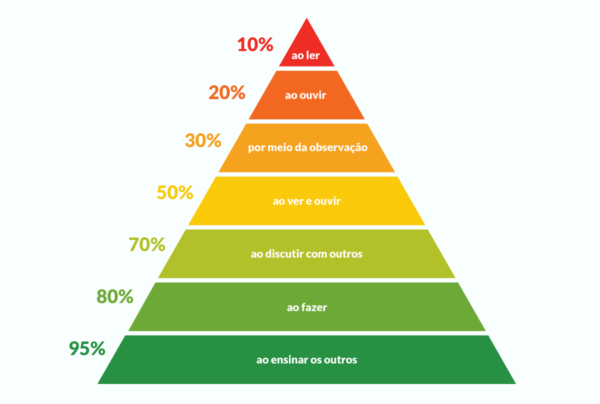
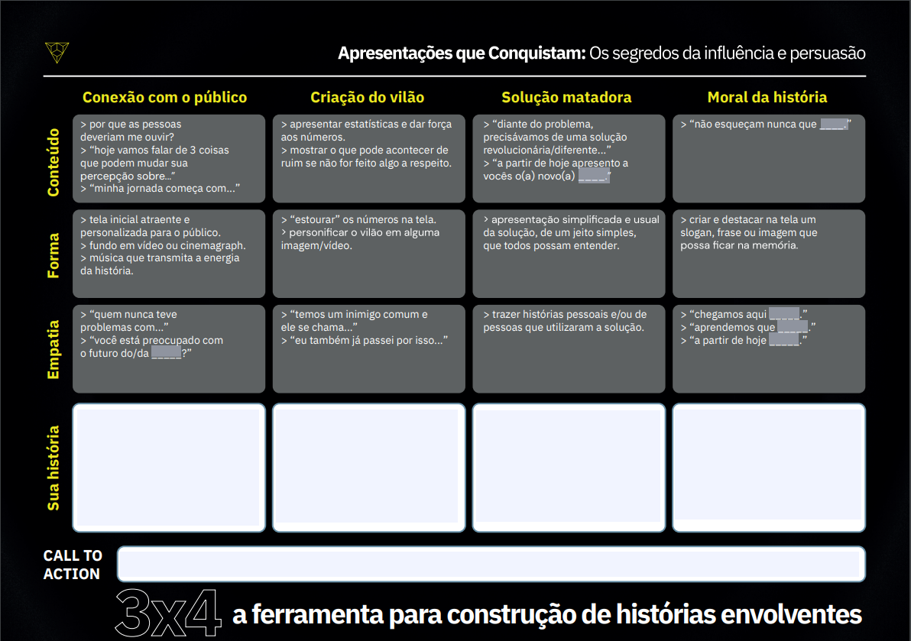
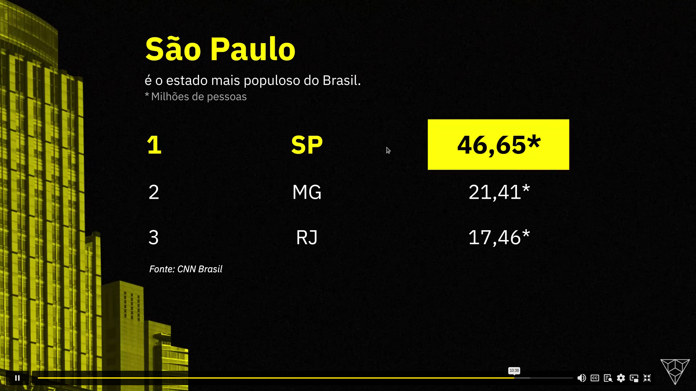
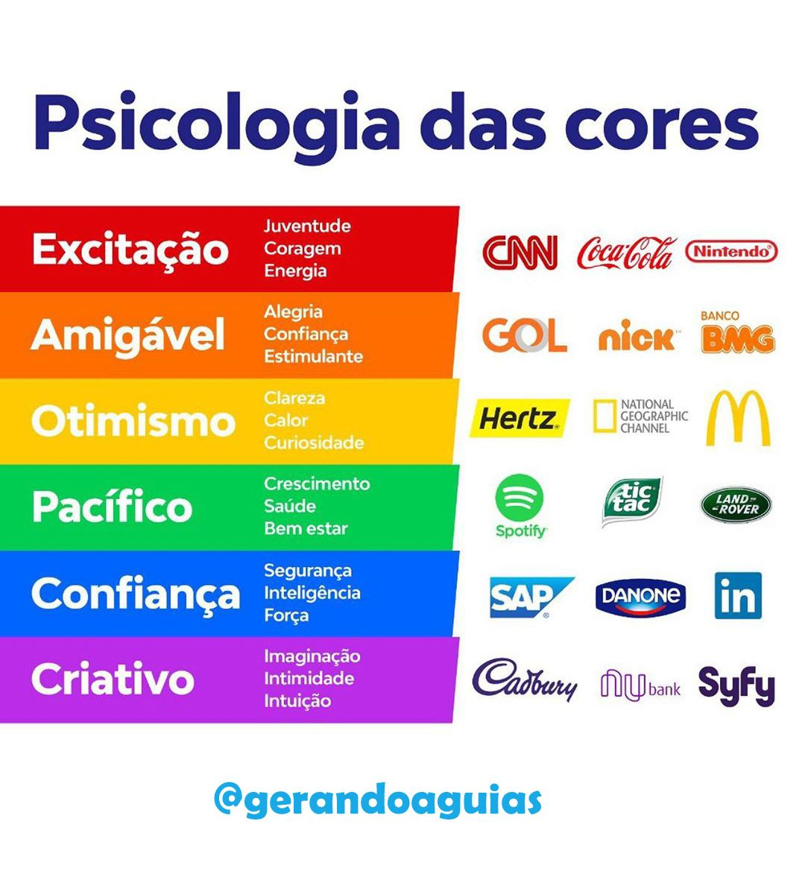

# Apresentações Que Conquistam: Segredos da Influência e Persuasão Conquer!

## Conquiste autoconfiança para ter um discurso convincente

Apresentações são essênciais para conectar o apresentador à audiência, isso por sua vez ajuda o conteúdo a ser entendido de forma mais simples e eficaz.

Para apresentações funcionarem elas precisam de 3 características:

1. Simples
2. Emocionante
3. Inteligente

### Simples

Para sua apresentação ser simples:

- Evite textos longos e complexos.
- Use gráficos, ícones e cores relevantes para o seu tema (redução do esforço cognitivo).
- Transmita a mensagem de maneira clara e direta.

### Emoção

Para sua apresentação ser emocionante:

- Use elementos que gerem conexão com o tema.
- Evite dados frios ou impessoais.
- Use histórias, exemplos, metáforas e analogias.

### Inteligente

Para sua apresentação ser emocionante:

- Use elementos que estimulem a aprendizagem.
- Use dados e fatos.
- Provoque e estimule o pensamento.

### Pirâmide de Aprendizado de William Glasser

Suas apresentações deveriam trazer o público para os níveis mais baixos da pirâmide.

Ao invés de simplesmente falar um texto ou passar uma informação, suas apresentações deveriam engajar o público e ensinar algo.
> "Agora já sabem que tal coisa..."

### Gatilhos Mentais

Atalhos criados pelo cérebro para tomar melhores decisões.

- **Mais caro é melhor**

  Você está prestes a escrever um livro muito importante para a sua vida, você precisa de uma caneta para escrevê-lo.

  Ao chegar em uma loja encontra duas opções:

  - Uma caneta preta por R$ 5
  - Uma caneta preta e tampa dourada por R$ 20

  Qual você compraria?

  Agora, qual você acha que vai suprir sua necessidade da melhor forma?
- **Porque**

  Imagine o seguinte cenário: Uma fila de 30 pessoas para tirar cópias em uma fotocopiadora.
  
  E você precisa tirar uma cópia, mas de forma urgente, a passar na frente dessas 30 pessoas.
  Como faria?
  
  A forma **inteligente** seria: "Tenho 5 páginas, poderia usar a fotocopiadora porque estou com pressa?"
  A forma **tímida** e com falha seria: "Posso por favor usar a fotocopiadora na sua frente?"

  > O "porque" informa a pessoa que temos um motivo por trás da ação.

  Esse gatilho pode ser utilizado em QUALQUER lugar e momento.

  Utilizei uma vez quando estava em um prédio de um hospital e precisava passar para o pronto socorro, porém a chuva do lado de fora não permitia. Mas sabia que as pessoas do hospital tinham um caminho interno, que os permitiam atravessar sem se molhar, então, cheguei à um guarda e disse:

  "Opa, boa noite! Posso passar para o pronto socorro aqui por dentro porque meu carro está na frente da entrada do pronto socorro?"

  Isso o fez aceitar na hora, claro que permitiria, meu carro estava logo ali na frente, quem não faria isso? Por isso que esse gatilho é poderoso, convencimento na maioria dos casos.
- **Escassez**

  Medo da perda.
  Valorizamos muito mais algo quando o perdemos ou quando tem data para expirar/vencer.

  Por isso que cursos grátis com tempo limitado são tão eficazes.
- **Prova Social**

  É mais fácil tomar uma decisão a partir da decisão de outros.

  Efeito manada.

- **Autoridade**

  Mostre-se especialista em um assunto e pessoas vão acreditar mais em você.

- **Afinidade**

  Genuíno interesse na pessoa para qual você está apresentando.

### Anotações Aula Ana Paula Padrão

- Qual a melhor forma de me comunicar com o meu público?
- Respirar com a barriga, controlar a respiração
- Storytelling muito bem feito

## Seja influente quando comunica

### Storytelling

Contar histórias para conquistar a audiência.

1. Conexão com o público
2. Criação do vilão  
  Uma dor do público
3. Solução matadora  
  Sua solução deve supreender, ser disruptiva e deve ser apresentada de forma anormal.
4. Moral da história

> Não entregue seu conteúdo de uma vez só, deixe o suspense pro final.

#### Os 3 elementos

> **Mente**  
O seu conteúdo em si.

> **Corpo**  
A forma como você embala esse conteúdo com vídeos, textos, sons, imagens.

> **Empatia**  
A forma como a dor do seu cliente é resolvida pela sua história.

#### Exemplo

Apresentação sobre como gerar valor pro seu negócio via equity.

Persona: Empreendedores C-Level de pequenas e médias empresas.

**Conexão com o público**

(Tela com um funil que na ponta tem um valor de R$ 1 milhão, mas as etapas são compostas de pequenas vendas de R$ 10, 50; Outras vendas maiores de R$ 500, 1000 e no final o milhão.)

Boa tarde gente, meu nome é Vitor, sou C-Level de uma companhia de software, tenho 5 anos de experiência no mercado de investimentos e venho apresentar para vocês sobre a solução para geração de valor para o seu negócio utilizando equity. Primeiro, gostaria de iniciar com uma pergunta. Quanto vale o seu negócio?
> Conexão feita com sucesso.

**Criação do Vilão**

(imagem de um gráfico onde tem o valor real do negócio e o valor vendido ou percebido e uma coluna muito alta do valor potencial)

90% dos pequenos e médios empreendedores no Brasil **não** sabem o valor do seu negócio. Eu também já passei por isso, já perdi incontáveis oportunidades de vendas, de sócios aceleradores, de liquidez por não saber precificar meu negócio.

**Solução Matadora**

Diante desse problema que afeta diversos empreendedores, eu resolvi tomar ação. Eu resolvi criar uma ferramenta capaz de precificar seu negócio e sugerir ações para aumentar o valor dele, por isso, eu gostaria de chamar aqui a frente qualquer um que se voluntarie para usar a ferramenta.

**Moral**

Use a ferramenta e aumente seu patrimônio hoje

### Dados

Dados adicionam credibilidade e convencimento à apresentação.

### Mantendo o engajamento

Sempre parar um tempo para perguntar coisas para o público, ou pedir que olhem para uma imagem ou vídeo, isso ajuda eles a "descansarem" de prestar atenção em você.

### Call to Action

Ao fim da apresentação, colocar um call-to-action.

## Laboratório prático de criação de apresentações

Elementos visuais em uma apresentação são muito importantes pois são entendidos mais rapidamente que textos.

É sempre importante simplificar visualizações de dados para que as pessoas olhem apenas para o mais importante.

### Hierarquia

Deve haver uma hierarquia entre elementos na sua apresentação, para que a atenção seja chamada apenas para os elementos e informações mais importantes.

### Cores

As cores tem vários significados, então use as cores de acordo com o sentimento que você quer passar na sua apresentação

### Imagens

- Cinematographs
- GIFs
- Vídeos

## Para além dos slides: seu corpo também comunica

Suas emoções ao falar tem impacto direto sobre a eficácia da sua apresentação. É necessário treinar as seguintes qualidades para ter certeza que as pessoas vão te ouvir:

- Segurança
- Firmeza
- Alegria
- Clareza

### Comunicação Não Verbal

Comunicação não verbal pode ser uma grande aliada quando estamos tentando decifrar o que as pessoas estão pensando e/ou sentindo, também pode nos ajudar a passar nossa informação de forma eficaz.

- Posição dos olhos
  > Olhos para cima, visão.
  > Olhos retos, auditivo.
  > Olhos para baixo, cinestésico.
- Gesticular
- Entonação de voz
  > Descentente, neutra e ascendente.

## Masterclass ao vivo de encerramento do curso (07/11)