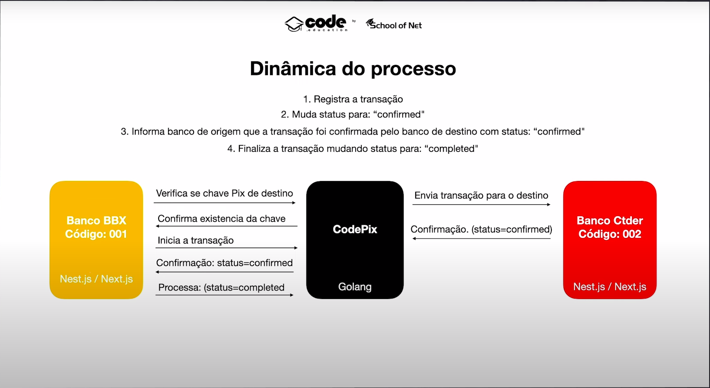
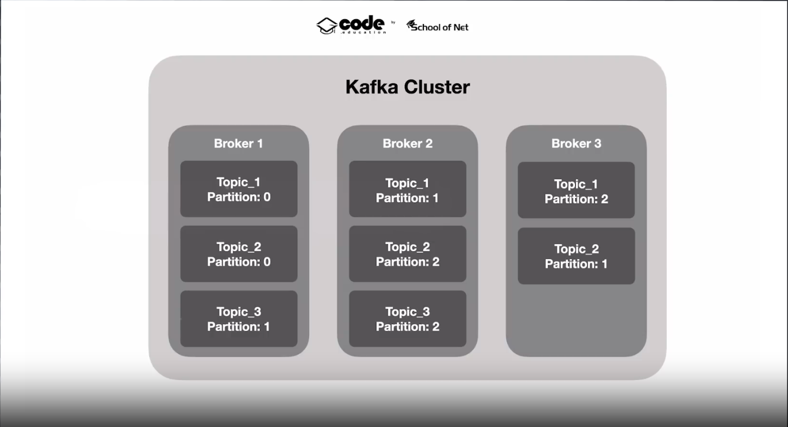
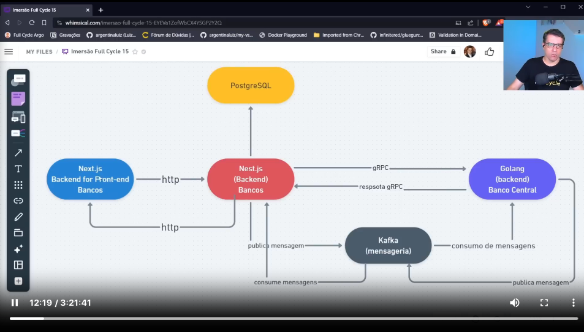
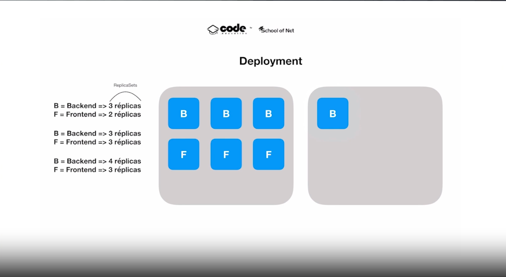

# O que é a arquitetura de microsserviços?

A arquitetura de microsserviços pode ser comparada com a linha de produção utilizada em fábricas.

Nessa arquitetura, cada "serviço" é um pedaço de código que executa uma tarefa.

# Full Cycle Developer

1. Operate what you build
  > Desde a concepção até a entrega
2. Ferramentas para escalar
  > Dominar ferramentas que vão o ajudar a escalar seu deploy

## Full Cycle vs Full Stack

Um full stack é uma pessoa que domina determinada stack, podendo programar tanto no back-end quanto no front-end.
Um full cycle é uma pessoa que além de desenvolver consegue testar, fazer o deploy e monitorar aplicações. Além disso, o full cycle domina processos que permitem que essas aplicações **escalem**.

## Processo de desenvolvimento

# CodePix

- É uma solução para simularmos transferências de valores entre bancos fictícios através de chaves (email, cpf).
- Simularemos diversos bancos e contas bancárias que possuem uma chave Pix atribuida.
- Cada conta bancária poderá cadastrar suas chaves Pix.
- Uma conta bancária poderá realizar uma transferência para outra conta em outro banco utilizando a chave Pix da conta de destino.
- Uma transação não pode ser perdida mesmo que: o CodePix esteja fora do ar.
- Uma transação não pode ser perdida mesmo que: o Banco de destino esteja fora do ar.

## Sobre os Bancos

- O banco será um microsserviço com funções limitadas a cadastro de contas e chaves Pix, bem como transferência de valores.
- Utilizaremos a mesma aplicação para simularmos diversos bancos, mudando apenas cores, nome e código. (multi-tenant).
- Nest.js no back-end.
- Next.js no front-end.

## Sobre o CodePix

- O microsserviço CodePix será responsável por intermediar as transferências bancárias
- Receberá a transação de transferência
- Encaminhará a transação para o banco de destino (Status: "pending")
- Recebe a confirmação do banco de destino (Status: "confirmed")
- Envia a confirmação para o banco de origem informando quando o banco de destino processou
- Recebe a confirmação do banco de origem de que ele processou (Status: "completed")
- Marca a transação como completa. (Status: "completed")

## Dinâmica do Processo



## Principais desafios

- Comunicação rápida e eficiente
- Criação e consulta instantânea das chaves (Síncrona)
- Garantia de que nenhuma transação seja perdida, mesmo que qualquqer dos 3 sistemas estejam fora (Assíncrona).

## CodePix

- Será capaz de atuar como um servidor gRPC.
- Consumir e publicar mensagens no Apache Kafka.
- Ambas operações devem ser realizadas de forma simultânea ao executar o serviço.
- Trabalhar com um design focado em solucionar o problema do domínio (DDD).
- Deixar a complexidade técnica para "camada de aplicação", responsável pelo servidor gRPC e Kafka.
- Flexível para implementação de outros formatos de comunicação, como API Rest, CLI clients, etc. SEM alterar nenhum outro componente da aplicação ou o modelo de domínio.

## Arquitetura de Software

Arquitetura é essencial para evitar retrabalhos, adiciona "sustentação" ao código e permite que você construa aplicações de forma mais eficaz.

Caso você não desenhe logo de cara como vai ser a arquitetura do seu software você pode transformar ele em uma *Tech Debt* que vai precisar ser paga em algum momento.

Pontos da arquitetura de software.

- Crescimento Sustentável.
- Manutenção.
- A complexidade inicial se paga ao longo do projeto.
- O seu software deve ser definido e desenhado por você e não pelo seu framework.
- As peças tem que se encaixar, mas eventualmente podem ser substituídas ou adicionadas.

## Arquitetura Hexagonal/Ports and Adapters

O mundo externo se conecta a nossa aplicação por meio de portas que são expostas pela aplicação.
E a aplicação se conecta a outras ferramentas via adaptadores.

## Estrutura e camadas do CodePix

- application
  > Responsável por lidar com o código por trás da regra de negócio
  - factory
    > Instância de objetos com muitas dependências.
  - grpc
    > Servidor e serviço disponibilizados via gRPC.
  - kafka
    > Consumo e processamento de transações com o Apache Kafka.
  - model
    > Modelagem dos dados que vem de diversas fontes.
  - usecase
    > Executa o fluxo da aplicação de acordo com as regras de negócio.
- cmd
  > Responsável por iniciar a aplicação.
- domain
  > Coração da aplicação e regras de negócios.
  - model
- infrastructure
  > Low-level, conexão com banco de dados.
  - db
    > Configuração do ORM e a interface com o banco
  - repository
    > Uma estrutura que permite a persistência de dados, independente de ser em uma API, banco de dados ou arquivo .txt

    > Chamado pelos "usecases"

## Recursos a Serem Utilizados

- Docker
- Golang
- Apache Kafka


# Aula 1 - Servidor

Estou criando o projeto no repositório [codepix](https://github.com/vitorgouveia/codepix).

Primeiramente foi criado o `Dockerfile` e o `docker-compose.yml`, eles permitem que eu execute toda a stack necessária (Postgres, Kafka, Go) sem ter que instalar nada na minha máquina.

Depois, utilizei o comando `docker-compose up -d` para iniciar todos os containers das aplicações, a partir daí, utilizei o comando `docker-compose ps` para listar todos os containers que estavam de pé e copiei o nome do container "app".

Fiz isso para entrar no container via bash com o comando `docker exec -it codepix_app_1 bash`, isso me permitiu trabalhar na minha pasta local utilizando tecnologias que não tinha instalado na minha máquina.🤯

## Arquitetura

A programação iniciou na pasta model. Lá, guardamos todas as entidades da nossa aplicação, junto das regras de negócio e interfaces para comunicação com o banco de dados.

Eu vi na prática que arquitetura de software é algo além do código, já que me vejo fácilmente implementando aquele mesmo código porém em Javascript ou Typescript. Inclusive pretendo fazer uma versão 2 desse projeto porém com javascript.

### Models

O interessante é que todos os models tem um método chamado `isValid()` que verifica as regras de validação dos campos e retorna uma exceção sempre que encontrar um erro.

Esse método é chamado na inicialização da Entidade, ou seja, toda vez que é instânciada ela automaticamente verifica se seus campos são válidos, o que é crítico para o funcionamento da aplicação, já que estamos lidando com o cru das regras de negócio.

# Aula 2 - gRPC

gRPC é um framework criado pela Google que tem o objetivo de facilitar o processo de comunicação entre sistemas de uma forma extremamente rápida.

- Ideal para microsserviços
- Mobile, Browsers e Backend
- Geração das bibliotecas de forma automática
- Streaming bidirecional utilizando HTTP/2

As linguagens que tem suporte oficial para gRPC são go, java, C (porém todas as linguagens se comunicam com C, então tem suporte para basicamente todas as linguagens).

## RPC (Remote Procedure Call)

Quando um cliente executa uma função do servidor.

## Protocol Buffers

*Protoco Buffers* é um mecanismo agnóstico de linguagem e plataforma, criado pela Google para serializar dados estruturados.

```
syntax = "proto3";

message SearchRequest {
  string query = 1;
  int32 page_number = 2;
  int32 results_per_page = 3;
}
```

## Protocol Buffers vs JSON

- Protocol Buffers tráfega os dados em formato binário, enquanto JSON usa texto.
- Serializar Protocol Buffers é mais rápido
- Gasta menos recursos de rede

## HTTP/2

- Dados são tráfegados em binário.

## Arquitetura

Nessa aula foi montada toda a estrutura de relacionamento do domínio da aplicação com o banco de dados e servidor gRPC.

Seguindo o SOLID, foram criados repositórios e use-cases, que são independentes de si e dependem de implementações desses contratos apenas.

Novamente, a arquitetura é muito importante, cada pasta tem seu funcionamento único:

- application
  > Responsável por lidar com o código por trás da regra de negócio
  - grpc
    > Servidor e serviço disponibilizados via gRPC.
  - usecase
    > Executa o fluxo da aplicação de acordo com as regras de negócio.
- cmd
  > Responsável por iniciar a aplicação e CLI.
- domain
  > Coração da aplicação e regras de negócios.
  - model
    > Modelos da aplicação que implementam as regras de negócio
- infrastructure
  > Low-level, conexão com banco de dados.
  - db
    > Configuração do ORM e a interface com o banco
  - repository
    > Uma estrutura que permite a persistência de dados, independente de ser em uma API, banco de dados ou arquivo .txt

    > Chamado pelos "usecases"

# Aula 3 - Kafka.js

## Dupla Latência

Fenômeno que acontece com arquitetura de microsserviços, onde para enviar uma resposta para o cliente é necessário chamar multiplos microsserviços, e isso pode acarretar em uma resposta mais demorada que o esperado.

## Kafka

É uma ferramenta para persistência de dados entre microsserviços, mitigando a perda de dados.

### Conceito Básico

#### Topic

- Stream de dados que atua como um banco de dados
- Cada tópico tem um local para armazenar seus dados
- Tópico possui diversas partições
  - Cada partição é definida por número. Ex: 0, 1, 2.
  - Você é obrigado a definir o número de partições quando for criar um tópico.

#### Producer & Consumer

- Producer produz os eventos
- Consumer consome os eventos

#### Kafka Cluster

- Conjunto de Brokers
- Cada Broker é um server
- Cada Broker é responsável por armazenar dados de uma partição
- Cada Topic está distribuido em diferentes brokers

Distribuição de Clusters Kafka



A replicação do Kafka faz cópias da mesma partição de um tópico em vários brokers, para garantir que nenhuma mensagem seja perdida.


#### Ecossistema

- Kafka Connect
  - Connectors
- Confluent Schema Registry

## Factories

São funções utilizadas para gerar dependências da aplicação (repositórios, use-cases).

## DTO

Transformam seu *input* de dados vindo do Kafka/gRPC/REST no formato de entidades da sua aplicação.

## Worker Threads

Utilizei as worker threads do Node.js para executar o servidor gRPC e Kafka de forma simultânea. Assim, cada um executa em uma thread.

## Inicializando a Aplicação

```bash
docker-compose down

docker-compose up -d --build

docker exec -it codepix_app_1 bash

npm run start all
```

# Aula 4 - Nest.js

Nessa aula vamos desenvolver a aplicação dos bancos, que vão utilizar das tecnologias:

- Nest.js (Back-end)
- Next.js (BFF & Front)
- Typescript
- PostgreSQL

## Arquitetura



## Kafka

O servidor kafka, o *control center* e o zookeeper estão agora centralizados em uma pasta `kafka`, em um docker-compose separado.

Para incializar, basta executar o seguinte comando:

```bash
docker-compose down

docker-compose up -d --build
```

## Arquitetura de Microsserviços

A comunicação tanto via gRPC e Kafka funcionou perfeitamente e é bonito ver os serviços se comunicando dessa forma.

## Nest.js

O Nest.js possui muito boilerplate, um modelo repetitivo de fazer as coisas, porém isso gera previsibilidade no código e permite a construção de aplicações padronizadas. O que é perfeito para trabalhar em equipes.

Foi muito fácil implementar a comunicação gRPC e Kakfa no Nest.js.

## Como inicalizar o Nest.js no Docker

```bash
docker-compose down

docker-compose up -d --build

docker exec -it -u root server_app_1 bash

BANK_CODE=001 npm run console fixtures
BANK_CODE=001 npm run start:dev
```

# Aula 5 - Next.js

Vamos utilizar o Next.js para desenvolver o front-end dos bancos.

Esse front-end vai utilizar de SSR (*Server Side Rendering*) com a nova arquitetura de rotas do Next.js com Server e Client components para entregar o HTML pronto com os dados pra o front-end.

Vamos também criar uma estrutura BFF no *Server-side* do Next.js para facilitar o acesso as APIs do Nest.js. Esse BFF vai utilizar das novas tecnologias mais recentes de cache do next.js para permitir um carregamento ainda mais rápido aplicação.

## Queries reutilizáveis

O código abaixo foi utilizado na Navbar e outros componentes da aplicação, isso porque, o *server-side* + cache do next.js permite que nós salvemos queries como essa para reutilizar em outras partes do código sem se preocupar com o cache ou state do React.

```js
import { BankAccount } from '@/models';

export const getBankAccount = async (id: string): Promise<BankAccount> => {
  const response = await fetch(
    `${process.env.NEXT_PUBLIC_API_URL}/bank-accounts/${id}`,
    {
      next: { revalidate: 20, tags: [`bank-accounts/${id}`] },
    },
  );

  return response.json();
};
```

## Client Side

Pouquíssimos componentes foram renderizados do lado do cliente, dessa forma, o bundle de javascript enviado para o navegador é minúsculo, carregando a aplicação *ainda* mais rápido.

<!-- # Aula 6 - DevOps

## Kubernetes

Kubernetes (K8s) é um gerenciador de aplicações de containers.

- Disponibilizado através de um conjunto de APIs.
  > Todas as funcionalidades Kubernetes são acessadas por APIs
- kubectl é a CLI para acessar essas APIs porém via linha de comando.
- Kubernetes Master

### Cluster

Cluster é um conjunto de máquinas (nodes).
Cada máquina possui um número de recursos (vCpu, Ram).

### Pod

Pod possui um ou mais containers rodando a aplicação.

### Deployment



## Dockerfile

Foi gerada uma dockerfile nova para todos os serviços, chamada de `Dockerfile.prod`, essa dockerfile vai executar o comando de produção de cada serviço.

Após isso, deve ser gerada uma imagem da dockerfile de cada serviço

```bash
docker build -t vitorgouveia1/codepix:latest -f Dockerfile.prod
```

E então, essas imagens devem ser enviadas para o dockerhub com o comando:

```bash
docker push vitorgouveia1/codepix:latest
```

## Kubernetes

Existem diversas formas de utilizar o Kubernetes em produção, como no Google Cloud Platform, Azure, AWS, Digital Ocean.

Porém, utilizarei local utilizando a ferramenta chamada [kind](https://kind.sigs.k8s.io)

Ele consegue rodar o kubernetes dentro de containers docker de forma local.

### Executando Local

Agora devemos iniciar a criação de um cluster para testar a aplicação.

```
kind create cluster --name=codepix 
```

> O kind irá criar um cluster com apenas 1 node.

Após isso, devemos "avisar" o kubectl que iremos trabalhar com esse cluster, para isso então, rode o comando:

```bash
kubectl cluster-info --context kind-codepix
```

Agora, tudo que for rodado via `kubectl` será dentro desse contexto do codepix.

Para ver isso em ação, liste os nodes utilizando

```
kubectl get nodes
```

---

Após todo esse *setup* inicial devemos criar os arquivos de configuração para iniciar um pod no k8s.

Para isso foram criados os arquivos `deploy.yaml`, contendo regras de funcionamento do pod e o `configmap.yaml` contendo variáveis de ambiente.

Com esses arquivos preenchidos, é possível rodar alguns comandos e subir nosso primeiro pod.

```bash
kubectl apply -f configmap.yml
kubectl apply -f deploy.yml

kubectl get pods # Lista 
```

### Comandos Úteis

```bash
kubectl get pods # Lista todos os pods.
kubectl logs <pod> # Lista os logs de dentro do pod.
kubectl describe pod <pod> # Lista os passos percorridos pelo k8s na construção do pod.
```
-->