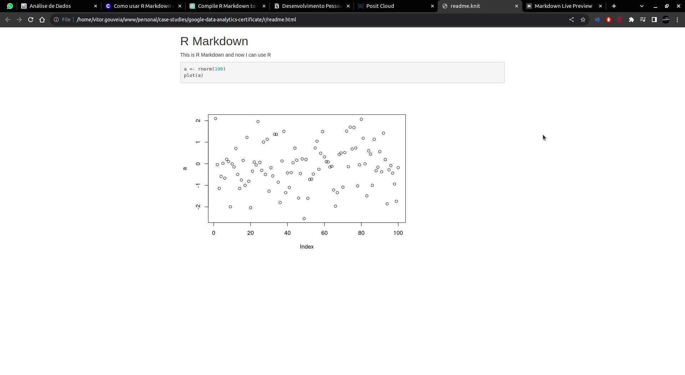

# R
A programming language used for static analysis and visualizations.

R can be used to _reproduce analysis_, _process lots of data_, _create data visualizations_

## Syntax

```r
  ggplot(data=penguins,aes(x=flipper_length_mm,y=body_mass_g)) + geom_point()

  # ggplot() => creates a empty plot
  # ggplot(data=penguins,aes(x=flipper_length_mm,y=body_mass_g)) => define data and labels for x and y axis 
  # geom_point() => uses points for visualization but it could be bars, lines and more
  # geom_point(color="purple") => changes color
  # geom_point(aes(color=species)) => assigns one color for each species
```

```r
print("Hello world") # -> prints out hello world to console (duh)

a <- rnorm(100) # -> assigns random values to 'a' variable
plot(a) # -> creates chart with 'a' variable
```

## R Script
R's way to executing files.

```bash
Rscript file.r
```

## Installing libraries

Run the following script to install the package in your computer as you would with `npm i` or `pip install pandas`

```r
install.packages("palmerpenguins")
```

## Using libraries

To use libraries, you can use the `library` helper, it works as a `import/from`

```r
library("palmerpenguins")
```

## Running with RScript

```bash
sudo Rscript index.r
```

### View your dataset as a table
```r
View(penguins)
Sys.sleep(100) # It put the program to sleep for 100 seconds so you have time to view the chart in the window that popped up
```

## Save with ggsave()

Use ggsave() to save chart as PNG

```r
ggsave("test.png")
```

## Generate PNG with plot

```r
library("palmerpenguins")
library("ggplot2")

bill_length <- penguins$bill_length_mm
bill_depth <- penguins$bill_depth_mm

fn <- 'graphic.png'

if(file.exists(fn)) {
  file.remove(fn)
}

# Create PNG file
png("mygraphic.png", width=1000, height=1000, units="px", pointsize=12, res=200, type="cairo")

# Plot chart
ggplot(data=penguins,aes(x=bill_length,y=bill_depth)) + geom_point(aes(color=species))

print("Chart Done!")

dev.off()
Sys.sleep(1) # Give time to image to be generated and then opened by syste

browseURL("mygraphic.png")
```

## Snippets

### Rename column

```r
rename(diamonds, carat=new_carat, size=new_size)
```

## Comments
Comments can be made with the "#" symbol

## Data Types

## Variables

To discover a variable type, use the "class()" function

```r
# Here's an example of a variable
hello <- TRUE

print(class(hello))

# To discover the type of a vector, use typeof

vec <- c(1, 2, 3, 4)
print(typeof(vec))
```

## Functions

Use "?" in front of a function name to get help on it

`?print()`

## Vectors

### Naming
You can name vectors based off another vector

```r
x <- c(1, 3, 5)

names(x)  
```

### Types
There are 4 types of vectors, _logical_, _double_, _integer_, _character_

```r
is.logical(vec)
is.double(vec)
is.integer(vec)
is.character(vec)
```

### Length
To determine length, use the `length()` function

### Numbers

```r
# Example with decimals
vec1 <- c(1.2, 1.4, 1.1, 0.8)

# Example with integers.
vec <- c(1L, 2L, 3L, 4L)
```

## Pipes

A tool in R for expressing a sequence of multiple operations, represented with "%>%"

```r
data("ToothGrowth")
library("dplyr")

filtered_toothgrowth <- ToothGrowth %>%
  filter(dose==0.5) %>%
  arrange(len)
```

```r
library("Tmisc")
library("here")
library("skimr")
library("janitor")

library("tidyr")
library("dplyr")
library("palmerpenguins")
library("ggplot2")

penguins2 <- penguins %>%
  filter(body_mass_g < 3400) %>%
  drop_na() %>%
  arrange(-bill_length_mm) %>%
  group_by(island) %>%
  summarize(mean_bill_length_mm = mean(bill_length_mm))
```

## Lists
Lists can have any type, different from vectors, which can have only one

```r
list("a", 1L, 1.5, TRUE)
```

## Date & Time
There are three way to express time in R with lubridate package

1. Date, ("2016-08-16")
1. Time, ("20:11:59 UTC")
1. Date and Time, ("2016-08-16 20:11:59 UTC")

- You can use the "today()" function to get today's date
- You can use the "now()" function to get today's date and time

### Format functions
All functions below return a date in the "yyyy-mm-dd" format

```r
library("lubridate")


ymd("2021-01-20") ## year, month, day
mdy("January 20th, 2021") ## year, month, day
dmy("20-Jan-2021") ## day, month, year
dmy(20210120) ## day, month, year

print(now())
```

Para passar uma data e hora para data é só usar a função "as_date()"

## Logical Operators
They work very similar to javascript

- "&&" AND
- "||" OR
- "!" NOT

# Cleaning data
The basics of data cleaning with R

## Select specific column

```r
select(column) # Selects only this column
select(-column) # Select every column except this one
```

## Rename column

```r
rename(new_column=column)
```

## Transform column names

```r
rename_with(penguins, toupper) # All columns go to uppercase
rename_with(penguins, tolower) # All columns go to lowercase
```

You can also check if your data frame has padronized columns with the "clean_names()" function from "janitor" library

## Data Frames
Are data separated by columns, can be created like this: 

```r
names <- c("vitor", "giovanna", "margot")
ages <- c(18L, 22L, 1L)

people <- data.frame(names, ages)
```

# Data Visualization

## ggplot2

The ggplot2 lib comes with the tidyverse library, to install tidyverse:

```r
install.packages("tidyverse")
```

To use ggplot, use the following syntax

```r
ggplot(data=your_data) # this will create an empty plot
ggplot(data=your_data) + geom_point(mapping=aes(x=x_axis, y=y_axis)) # 'geom_point()' adds a new layer to ggplot
# All columns can be used inside the 'aes()' function
```

### Coloring data points

```r
ggplot(data=your_data) + geom_point(mapping=aes(x=x_axis, y=y_axis), color="purple") # sets all data points to purple
ggplot(data=your_data) + geom_point(mapping=aes(x=x_axis, y=y_axis, color=column)) # sets data points to a random color based on the column

# Properies include
# - color
# - size
# - alpha
# - shape
```

### Geom functions

- geom_point
- geom_bar
  Properties: fill
- geom_line
- geom_smooth

### Bar charts

Use the `geom_bar` function

### Facet functions

Facet functions can create multiple plots by a column

```r
ggplot(data=penguins) + geom_point(mapping=aes(x=flipper_length_mm, y=body_mass_g, color=species)) + facet_wrap(~species)
ggplot(data=penguins) + geom_point(mapping=aes(x=flipper_length_mm, y=body_mass_g, color=species)) + facet_wrap(sex~species) # Facet grid
```

## Labels

You can add titles, subtitles and captions like so:

```r
ggplot(data=penguins)
  + geom_point(mapping=aes(x=flipper_length_mm, y=body_mass_g, color=species))
  + labs(title="Palmer Penguins: Body Mass vs. Flipper Length", subtitle="Sample of three penguins species", caption="Data collected by me from 2021 to 2023")
```

### Annotations
You can annotate specific data points in the plot with the `annotate()` function like so:

```r
  annotate("My text", x=220, y=110, label="This is my annotation")
```

references:

- https://ggplot2.tidyverse.org/reference/annotate.html
- https://ggplot2-book.org/annotations.html
- https://www.r-bloggers.com/2017/02/how-to-annotate-a-plot-in-ggplot2/
- https://viz-ggplot2.rsquaredacademy.com/ggplot2-text-annotations.html

# R Markdown

Markdown with R superpowers.

It can work as a report and analysis results combined into one.

[example](./readme.rmd).

## How to use

Create a .rmd file and use markdown to express text. To express code, use code chunks like this:

<pre>
```{r}
  test <- "your code here"
```
</pre>

If you use plot or ggplot inside these code chunks, the respective plots will appear in the final document.


## Compilation

You can compile R Markdown to HTML like so:

```r
# install.packages("rmarkdown")

library(rmarkdown)

setwd("/home/vitor.gouveia/www/personal/case-studies/google-data-analytics-certificate/r")
rmarkdown::render("readme.rmd")
```

Now a .html file will be generated contaning your R Markdown document and charts



[Cheatsheet](https://bookdown.org/yihui/rmarkdown-cookbook/hide-one.html)
[Interactive HTML Documents](https://bookdown.org/yihui/rmarkdown/interactive-documents.html)
[R Charts](https://r-charts.com/)