# Google Project Management Certificate

## Foundations of Project Management

### What is Project Management?
Project Management is the application of knowledge, skills, [tools](#software) and [techniques](#methodologies) to meet the project requirements and achieve the desired outcome

> **Project**  
> A project is temporary but unique endeavor, has defined time to begin and end, and usually includes a set of unique deliverables. 

It is a series of tasks that needed to be completed to reach a desired outcome. To reach this outcome, collaboration and careful planning is needed.

That's where *project management* kicks in, it's critical for projects to be delivered on time and on budget while taking the maximum out of the team you're working with. Project Management *ensures* that a project delivers the expected outcomes.

#### Methodologies

- Agile
- Scrum
- Waterfall

#### Software 

Scheduling Tools:

- Google Sheets
- SmartSheet

Productivity and Collaboration Tools:

- Google Drive
- Gmail

Project Management Tools:

- Asana
- Trello
- Notion

### What does a project manager do?

Project Managers usually follow a process that involves:

- Planning and Organizing
  > Gathering requirements from teamates, stakeholders or customers.
  > Create project plan.
- Managing Tasks
  > Manages tasks for the team.
  > Communicates key milestones to customers or stakeholders.
- Budgeting
- Controlling costs and other factors

Everything PMs do envolve making sure that a project is completed on budget and on time. The PM also needs to make sure that the project outcome is bringing value to the company.

### Career

The career for a Project Managet is really flexible, you can apply skills you've obtained in one industry into other industries.

Like developers, there's also a high demand for Project Managers.

#### Searching for a Job

You don't need to apply for jobs with title of "Project Manager", any role with any of the skills learned in this course can be in your radar.

The career that best suits with my current knowledge is: **IT Project Manager**

#### Introductory-level project management roles

> **Junior Project Manager**  
> Performs all aspects of being a project manager alongside a more experienced professional.

> **Project Administrator**  
> Assists the rest of the project team with administrative tasks.

> **Project/Program Assistant**  
> Supports team members working on a project and offers administrative support. May perform research or create training documents along with other jobs as assigned by program leaders.

> **Project/Program Coordinator**  
> Participates in hands-on project work and administrative tasks. Works under a project manager to make sure projects are completed on time and within budget.

> **Project Support Specialist**  
> Works alongside a project manager and team members to oversee assigned projects. May also be responsible for training and developing employees to perform designated tasks.

---

#### Traditional project management roles

> **Project Manager**: 
> Responsible for the initiating, planning, executing, monitoring, and closing of a project. Includes industry-specific titles like IT project manager, construction project manager, or engineering project manager, which utilize skills that are transferable among industries.

> **Project Analyst**: 
> Moves a project along by sharing information, providing support through data analysis, and contributing to strategy and performance. 

> **Project Leader/Director**: 
> Drives core decision-making and sets the direction for the project. Usually knowledgeable about the product or deliverable. 

> **Project Controller**: 
> Primarily responsible for project planning. You are likely to see this job title in industries like engineering and construction.

> **Technical Project Manager**: 
> Conducts project planning and management for identified goals within a company. Ensures that projects are completed to the requirements within a defined time frame and budget.

> **Project Management Office (PMO) Analyst**: 
> Manages the progress of complex projects to ensure timely execution and completion. 

#### Operational management roles

> **Operations Analyst**:  
> Manages and coordinates research, investigates workflows, creates business procedures, and recommends changes to improve the project and company. 

> **Operations Manager**:  
> Oversees strategic decision-making and rolls out plans of action based on financial, schedule, and resource reporting. 

> **Chief Operating Officer**:  
> Responsible for overseeing the day-to-day administrative and operational functions of a business.

#### Agile roles

> **Scrum Master**: 
> Coordinates and guides the Scrum team. Knowledgeable in Agile framework and Scrum and is able to teach others about the Scrum values and principles. May also be listed as a Technical Program Manager or Technical Project Manager. 

> **Product Owner**: 
> Drives the direction of product development and progress. 

#### Career path of a Project Manager

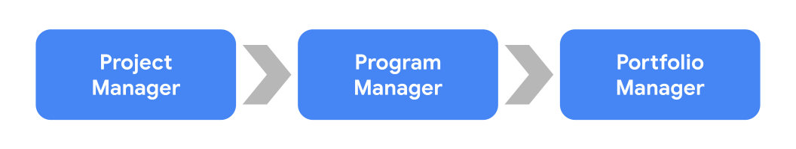

**Program managers**: Manage a group of projects that are related or similar to one another and handle the coordination of these projects. They facilitate effective communication between individual project managers and provide support where necessary. They also help create and manage long-term goals for their organization.

**Portfolio managers**: Responsible for managing a group of related programs within the same organization. They coordinate various programs in order to ensure they are on track and that the organization is meeting its strategic initiatives. Portfolio managers look at all projects and programs within the organization and prioritize work as necessary. 

#### Buzzwords

- Coordination  
Getting people and teams to work together.

- Organization  
The ability to stay focused on different tasks.

- Leadership  
Being able to lead a group of people.

Here's a list of buzzwords you could include on your resume or use to search jobs:

- Analytical
- Assertive
- Assessing outcomes
- Assessing progress
- Attention to detail
- Conflict resolution
- Collaborative
- Coordination
- Communication
- Development
- Evaluation
- Executing plans
- Financial analysis
- Impact assessment
- Leadership engagement
- Managing meetings
- Managing client expectations
- Managing conflicts
- Managing relationships with stakeholders
- Managing vendors
- Meeting deadlines
- Monitoring
- Multitasking
- Planning
- Prioritizing
- Problem-solving
- Process development
- Process improvement
- Project coordination
- Project implementation
- Project initialization
- Project planning
- Project reporting
- Quality control
- Risk assessment
- Risk management
- Solution development
- Strategic planning
- Strong interpersonal skills
- Strong verbal communication
- Strong written communication

### The Value of a Project Manager

There are 3 main ways a project manager can bring value to their team or business:

- **Priorization**  
Effective priorization of tasks required to complete a project. 
This is a key component of PMs, they need to make sure that the right tasks are prioritized so the project can flow smoothly.

- Delegation  
Matching tasks to individuals who can best complete the work. 

- Effective Communication  
Effective communication with stakeholders.

### Key Roles and Responsibilities

The big responsibility is to coordinate a team to a successful project, this does not mean you're their "boss", you are just the project management expert, just like the data analytics expert, or web development expert.

- **Planning and Organizing**
  - Making use of productivity tools and creating processes
  - Create plans, timelines, schedules, and other forms of documentation to track project completion (and mantain those documents over the project life)
- **Managing Tasks**
  - Make sure tasks are completed on time
- **Budgeting and controlling costs and other factors**
  - Monitor and manage the budget
  - Track issues and risks
  - Manage quality
  - Remove unforseen barriers  
    Remove "barriers" that don't let your team progress on the project.

Because you will work with a team, there's a set of functions you are responsible for:

- Hold all team members accountable for their assigned tasks
- Ensure that issues and risks are tracked and visible, and establish escalation paths
  > Communicate issues to the right people, at the right time.
- Understand and help teammates to adopt the right workflows and project management styles
- Collaborate with other teams at the organization to deliver solutions that meet the requirements based on project scope, schedule and budget

### Working with cross-functional teams

A cross-functional team includes team members who have different backgrounds, types of expertise, and job functions. They're usually called T-shaped professionals.

To work with cross-functional teams in a effective way you need to:

- Clarify Goals
  > It's crucial that every teammember understands they role and the goals of the project.
- Get team members with right skills
  > As a PM, you must ensure that your team has the right people with the right skill set needed for the project to succeed.
- Measure progress
  > Communicate milestones to stakeholders and teammates keeps them motivated and is part of the project success.
- Recognize efforts
  > As a PM it's your job to make sure every member of the team is recognized for it's efforts.

### Skills
 
- Enabling decision making
  > Provide enough information so the team can make informed decisions.
- Communicating and escalating
  > Documenting plans, sending e-mails about the status of the project, holding meetings.
- Flexibility
  > Being able to change directions while in the middle of a project.
- Strong organizational skills
  > Ability to organize processes, tasks, milestones.

### Project Life Cycle

1. Initiate the project
2. Make a plan
3. Execute and complete tasks
4. Close the project

#### Initiate the project

In this project you will need to define:

- Define project goals
  > Define what to be done so the deliverable can be achieved
- Determine resources, budget, people, stakeholders and other project details
  > Determine *everything* you need to complete the project
- Get project approval
  > Contact stakeholders to approve the project

Then you will document all this information into one place to showcase the project's value and get the approval to get it going.

#### Make a Plan

Your plan must include:

- Create a budget
- Set the schedule
- Establish team roles and responsibilities
- A breakdown of all tasks that need to be completed
- Plan for risk and change
- Establish communications
  > How the team can communicate their questions, how can they know their tasks

#### Execute and complete tasks

A Project Manager *does not* execute the tasks, a Project Manager is responsible for:

- Manage the progress
- Communicate
  > Keep the team motivated, clarify any uncertanties
- Make adjustments to the schedule
- Removing potential roadblocks
- Monitor progress
- Break down barriers

#### Close the project

- Ensure all tasks are completed
- Confirm acceptance of the project outcome
- Evaluate what worked and what didn't
- Communicate progress to stakeholders
- Celebrate the effort

And pass the project to anybody who's going to use it.

### Methodologies

There are two main types of Project Management methodologies:

**Linear**

The linear approach means that phases of the project must happen sequentially, one must only start when the previous one finished.
In this type of methodology, the agreed upon result defined in the *project initiation* phase is what will get delivered.

**Iterative**

The iterative approach can have overlapping phases and tasks at the same time other tasks are being worked on.
In this type of methodology, the final result is flexible and can be changed as the project is completed.

Two of the most popular project management methodologies are:

- Agile
- Waterfall

#### Waterfall (linear)

The waterfall methodology works like a real waterfall, where tasks are sequentially put out to be done, one after the other.

#### Agile (iterative)

The agile methodology is an iterative, fast-moving and flexible approach.

Project phases overlap and tasks are completed in iterations, which in Scrum* are called **Sprints**.

*Scrum = Type of Agile.

#### Lean Six Sigma

Used in project with goals to:

- Save Money
- Improve Quality
- Move through processes quickly

The main idea of Lean Six Sigma is to focus on the team collaboration, that will promote a positive work environment and motivation and productivity will surge.

There are 5 phases to Lean Six Sigma:

1. Define
  > Define the project goal
2. Measure
  > Use data in order to analyze where is the problem in the process
3. Analyze
  > Identify gaps and issues
4. Improve
  > Start making improvements
5. Control
  > Implement the solution and make sure the company doesn't revert back to initial state.

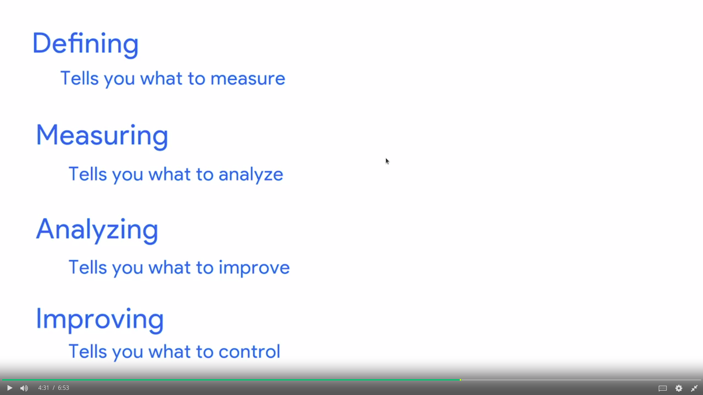

### Organizational Structure

How the company employees are structured.

Understanding the organizational structure of the company you work in is important so you can know who to respond to, show milestones or identify stakeholders.

#### Classic

Funcional or top-down structures are defined by having the CEO or President and then people below it, usually managers or coordinators and finally the rest of the employees.

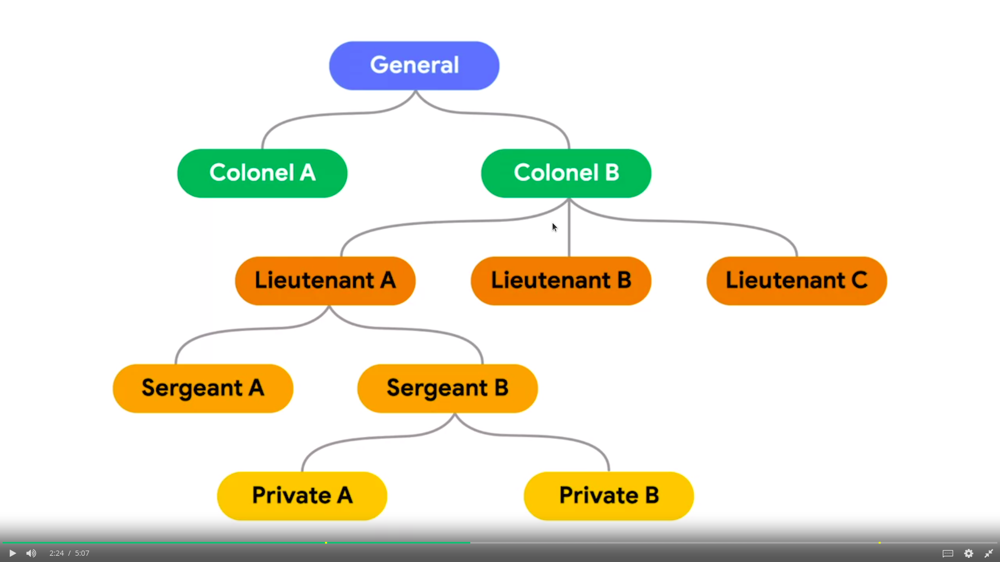

#### Matrix

In this structure you have to respond to stakeholders from other departments.

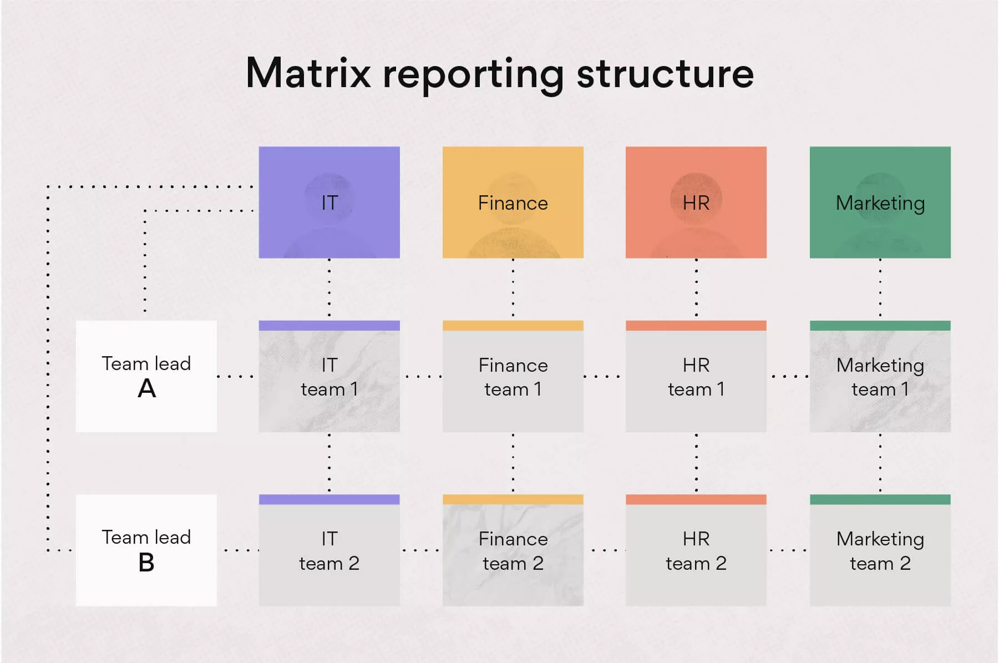

## Project Initiation: Starting a Successful Project

### Why is it important?

Because it's the foundation of a project, if you do it badly your project might not meet expected deadlines or expectations from stakeholders.

---

Project initiation starts after a problem or opportunity has been identified.

It is in this stage that **goals**, **scope**, **stakeholder expectations**, **resources** and **ideas** are defined.

- Goals
  > What you've been asked to do and what you're trying to achieve. The desired outcome.
- Scope
  > Process to define the work that needs to be done to complete the project
- Deliverables
  > Products and services created in the project
- Success Criteria
  > Benchmark to measure how successful the project is
- Stakeholders
  > People who and interested in the project or are affected by it
- Resources
  > Budget, people, materials

Here you also build a thing called **Project Charter** aka **Scope of Work** document, which is a document that outlines the whole project and it's properties.

### Goals
Figure what exactly what needs to be done for the goal to be met. For that you need to really define what are the **goals** and **deliverables** with stakeholders.

> What to accomplish => How to accomplish => Know when it's accomplished

For that, we can use a framework for defining goals called S.M.A.R.T.

#### SMART

- Specific
  > What do I want to accomplish?

  > Why is this a goal?

  > Who is involved?

  > Where should the goal be delivered?
- Mesurable
  > How much?

  > How many?

  > How will I know when it's accomplished?

  > What metrics are important?
- Attainable  
  🛑 Cannot be too extreme otherwise it won't be met
  > Can it reasonably be reached?
- Relevant
  > Does it meet company priorities and vision?

  > Does the effort balance out the benefits?
- Time-bound
  > Define a time for completing the task

#### OKRs

OKRs help to clarify goals and measure it. They take [S.M.A.R.T](#smart) a step further, you can also mix and match to get the result you prefer.

- O
  > Is the objective, qualitative.

- KRs
  > Measurable outcomes that define when the objective has been met.

It's possible to OKRs per-project basis and use that is support for bigger and more ambitious OKRs.

#### Assigning tasks

You'll need to assign the tasks needed to accomplish the goal for the team, for that, you can use the RACI chart, which maps out whos responsible for what.

A RACI chart helps define roles and responsibilities. It's defines in four parts:

- Responsible
  > People who are completing the tasks, the team.
- Accountable
  > People making sure the tasks are completed, project manager.
- Consulted
  > Those giving feedback, subject matter experts or decision makers.
- Informed
  > Those that need input when the work is done, stakeholders.

Example of RACI chart:

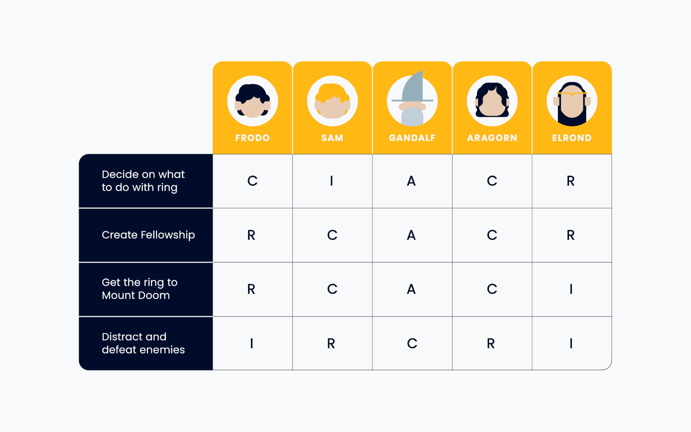

### Scope

The scope defines the boundaries of the work that needs to be done in order for the project to be complete. **Timeline**, **resources** and **budget** are crucial for a well-defined scope.

The scope has to be very well planned out because any changes to it could impact the budget, schedule and more.

It's crucial to talk to stakeholders to get a better understanding of expectations and scope.

There are some question that help to better identify scope:

- Where did the project come from?
- Why is it needed?
- What is the project expected to achieve?

#### In-Scope

Tasks that are included in the project plan and contribute to the project's goal.

#### Out-of-scope

Tasks that were not included in the project plan.
Tasks that don't include the project goal.

#### Scope Creep

Factors that affect a project scope.

The scope creep is very dangerous because deviating from scope can change budget, delivery time and more.

There two main sources of scope creep:

1. External
  - Customer requests
  - Environment shifts
  - Changes in technology
2. Internal
  - Product improvements
  - Bugfixes

To avoid scope creep you can:

- Make project plans visible
- Get clarity on project requirements

#### Managing Scope

For dealing with changes in budget, priorities or deadlines, it's possible to use the *Tripe Constraint Model*.

- Scope
- Cost
- Time

Modifying any of the points of this constraint can lead to chaning other points.

### Deliverables

The final product created to solve a problem and/or reach the goal.

This deliverable should be aligned with stakeholders expectations to avoid any conflicts.

#### Stakeholders

It's mandatory to create a Stakeholder Analysis Power Grid, to define where which stakeholders are priority and which are not.

See an example below:

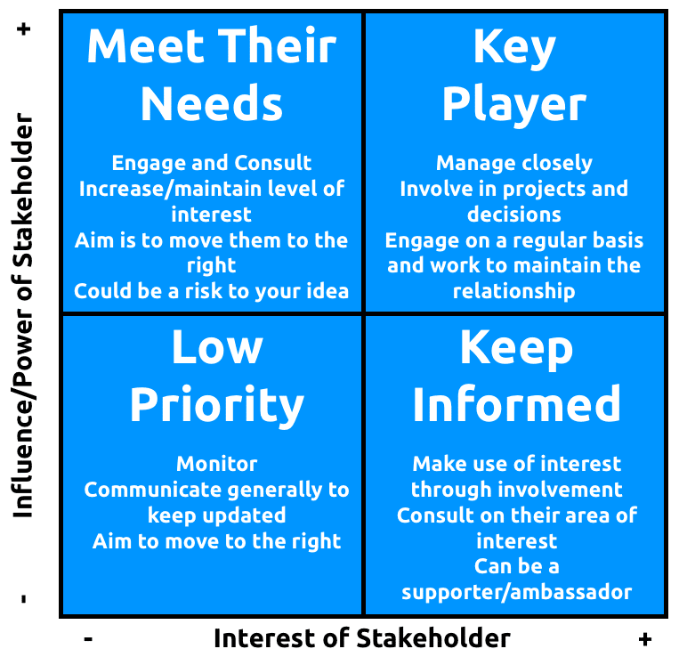

### Success Criteria

The project success criteria must be created in the [Project Charter](#project-charter) and defines the success when the project is **launched**.

At every step of the project you must check if the success criteria are being met and if on time.

Project Launch = Delivery of all tasks
Project Landing = Measure project success after it has been launched.

After the project has launched, you start the "landing" phase, you need to measure customer satisfaction, to see if the product works as intended.

#### OKRS

You can use OKRs, more specifically the KRs (key results) to measure progress as the project evolves. It's really important to share this progress periodically with stakeholders and your team.

### Resources

Just like in a survival context, mapping out all resources you have at your disposal is crucial for a successful project.

Resources can be divided into 3 parts:

1. Budget
2. People
3. Materials

#### Budget

Budget is an estimate amount of what will be spent on the project for completion, it's needed for hiring out a team, contrating third-party services, software and more.

#### Team

The team is also a resource, a well organized and efficient team can use their time to make valuable work and money for the company.

1. Roles, make a list of roles you need to complete every task of the project
2. Team size, set team size required for completing tasks on schedule
3. Necessary skills, skills your team members need to have in order to finish the project
4. Availability, check if team members have enough time and motivation to dedicate efforts on the project

There are 4 main roles in a team:

1. Sponsor
  > Project Sponsor provides for the team and is held accountable for project's success
2. Manager
  > Oversees activities and helps the team move forward
3. Team Member
  > Realizes everyday tasks
4. Stakeholders

#### Materials

Items needed for project conclusion.

It can be:

- Software subscription (notion, monday, jira)
- Computer and hardware for the team

### Project Charter

As a wrap-up you can build a project charter to document all steps taken until now and present it to stakeholders for approval.

This document also works as fuel to the team, it gives direction and clearance of what to do.

#### Project Proposal

A project proposal comes at the very beginning of a project and is a document that persuades stakeholders to start a project.

---

The structure of a project charter is the following:

- Project Summary
  > Explain the project briefly
- Goals
  > SMART goals of the project
- [Deliverables](#deliverables)
  > What will be delivered in the project?
- Business Case
  > Why the project exists?
- Benefits, costs and budget
- [Scope](#scope)
  > What is in scope and definitely out of scope
- [Project Team](#team)
  > Define Sponsor, Manager, Team and Stakeholders
- Success Criteria
- Schedule / Timeline or Milestones

Example of a document:

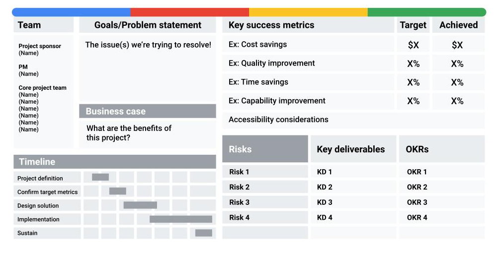

## Project Planning: Putting it All Together

Benefits of planning a project correctly:

- Understand the work needed to achieve your goals
- Coordinate efforts and timelines with other teams, contractors, and vendors
- Identify and prepare for risks (change of project direction, delay in the timeline)
- Get support from key members of the project team

There are 3 parts to a well defined project plan:

- Schedule
  > The timeline of tasks in the project, has start and end dates.
- Budget
  > Total cost to complete the project.
- Risk management plan
  > Searching for possible problems and planning ahead to mitigate them.
  > Where might the schedule get off track? Where might the budget exceed your estimates?

### Project Plan

The project center is the core of the project and holds all information important to it, it is based on the schedule of the project.

Example:

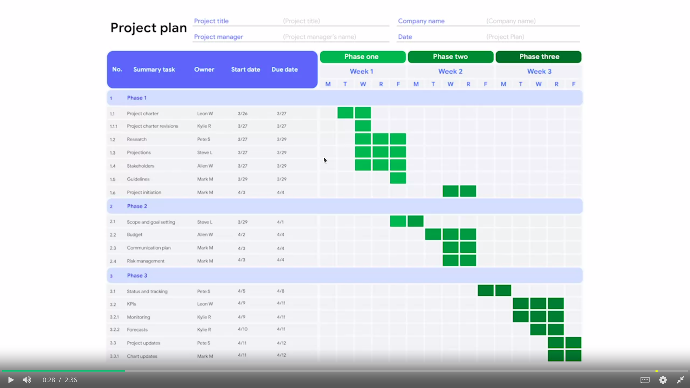

Components of a project plan:

- Tasks
- Milestones
- People
- Documentation
  > Charter, RACI chart, risk management plan...
- [Time](#estimating-time)
  > Expected times for tasks and milestones
- Scope and Goals
- [Work Breakdown Structure](#work-breakdown-structure)
- Budget
- Management plans
  > Change management plan, Risk management plan, Communication plan

### Project Kickoff Meeting

The first meeting in which a project team comes together to ground everyone in a shared vision, project goals, scope and roles.

Meeting agenda:

- Introductios
  - Team member names
  - Project roles
- Background
  - How the project came to be
  - Why the project matters
  - Set a shared vision
- Goals and Scope
  - In-scope
  - Out-of-scope
  - Target launch date
  - Milestones
- Roles
  - What work will each team member do
- Collaboration
  - Shared tools and documents
  - Communication expectations

### Milestones

An important point within the project schedule that indicates progress and usually signifies the completion of a deliverable or phase of the project.

Setting milestones is crucial to see how much work it will need to be done for project to be delivered, that's because they have a set **deadline** and a set number of **tasks**.

Deadlines help ensure if your project is off track

Tasks allow for you to see how much work needs to be done, because every task should help complete a milestone

An example of a list of milestones could be:

1. Get website design approval from stakeholders
2. Build the website
3. Get website quality approval from users

#### Tasks

- The team members should easily access their tasks
- Tasks should always contain the information needed for it to be finished
- Tasks should have a due date
- Each task should have 1 owner

#### Work Breakdown Structure

Work Breakdown Structure (WBS) is a structure that allows for easy visualization of all projects tasks

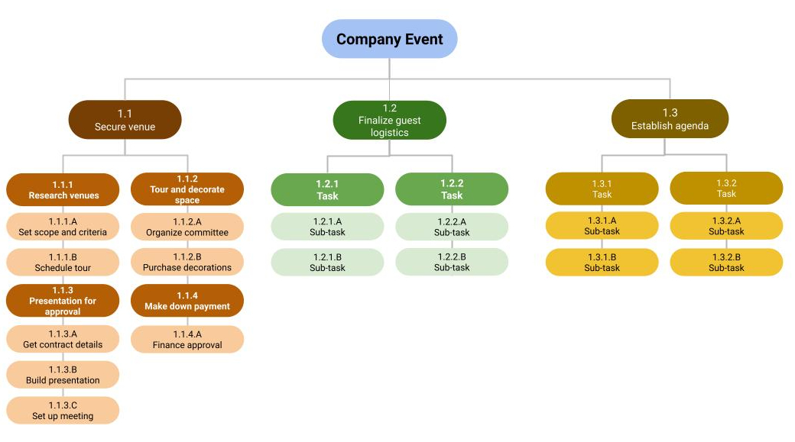

#### Gantt Chart

Gantt chart allows for easily visualization of the schedule of the tasks created

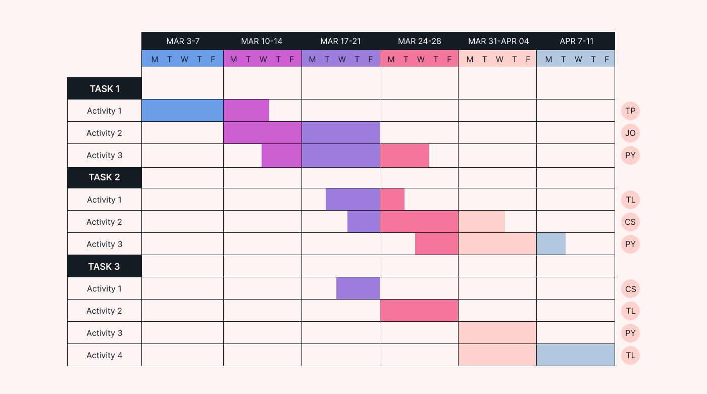

#### Estimating time

The estimates of milestones and tasks are crucial for the overall schedule, if all tasks have their time estimated in the wrong way the schedule might be pushed back.

You as the project manager **can't** make a better time estimate than teammate that is going to work on that task, so you should always communicate with teammates to find a reasonable time estimate for tasks.

To get the best results out of your teammate you should always ask open-ended questions:

- How complex is each step of this task?
- How long does it normally take you to create a website?
- What's the longest you've took to create a website and why?

---

When estimating time you can use a tool called **Buffer**, which consists of adding additional time to the end of a task or project to account for delays, bugs or any general slowdowns.

- Task Buffer
  > Are added onto tasks that are out of the team's control.
  > Should be used with caution since could unecessarily increase project schedule.
- Project Buffer
  > Is added to the end of a project and can't be too big.

### Critical Path

Critical path is the **bare minimum** number of milestones that need to be met in order for the project to be completed.

Anything that is outside the **critical path** is not a priority and should only be visited at the end of the project.

Follow these steps to find the critical path of your project:

1. List all tasks
2. Set dependencies
  > See which tasks need to be completed before other can begin
3. Create a network diagram

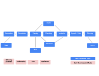

4. Make time estimates for each task

Now traverse your network diagram and find the longest path, that's your critical path.

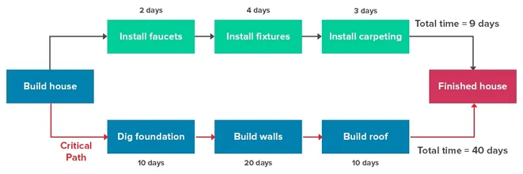

### Schedule

The schedule is the center piece of the project plan.

It is a visualization of all tasks involved in the project.

To create a schedule, it is possible to use a Gantt Chart.

- A gantt chart offers a highly visual representation of start and end dates
- It also helps to visualize what tasks are happening at each stage of the project and who is responsible for them
- Identifies parallel tasks

To build this gantt chart you can use Google Sheets, see this example from Google:

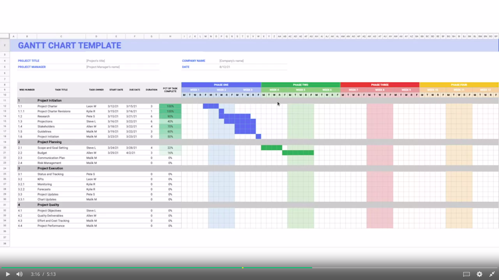
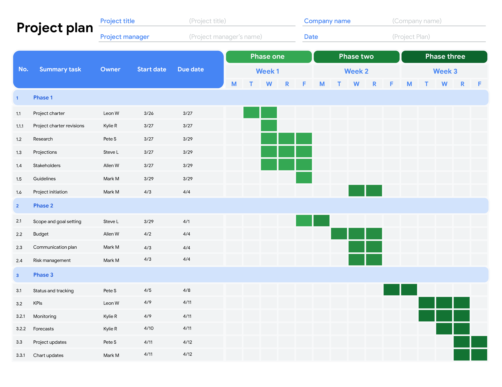

### Budget

A budget is the estimated cost of all resources of the project.

A budget is necessary because it shows how much a project is worth investing.

A budget needs to breaken down by milestones, this ensures that you calculate the expenses correctly.

Budget costs include:

- Software licenses
- Salaries of employees
- Staff training

> The budget may get updated and adjusted over time.

Your job as a Project Manager is to get the budget as close as possible to the real value you will spend on the project.

## Project Execution: RUnning the Project
## Agile Project Managements
## Capstone: Applying Project Management in the Real World